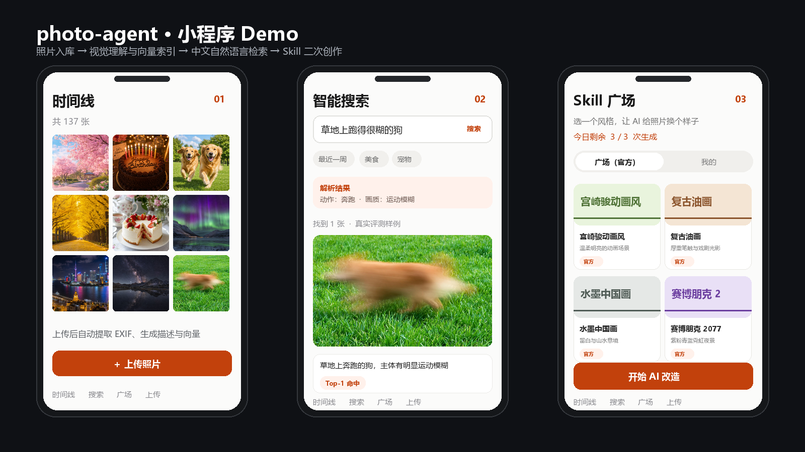
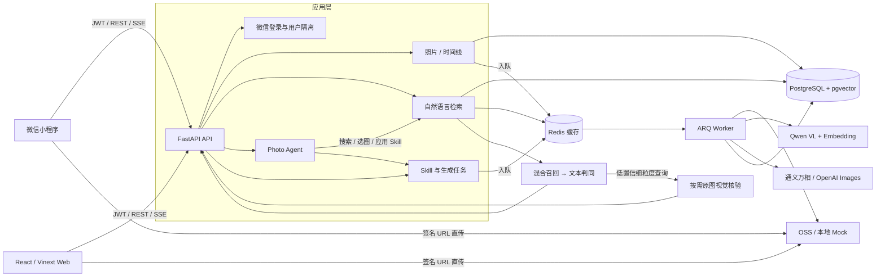

<div align="center">

# photo-agent

**中文语境下的 AI 照片管家：把“存照片、找照片、再创作”串成一个完整闭环。**

Web / 微信小程序 · FastAPI · PostgreSQL / pgvector · Redis / ARQ · Qwen VL / Embedding / Chat · 通义万相 / OpenAI Images

</div>

Photo Agent 让用户直接上传手机照片，由异步 Worker 自动完成 EXIF 提取、缩略图生成、视觉理解与向量索引；随后可用“公交车里拍糊的窗外车流”这类中文自然语言检索，也可以从 Skill 广场选择风格，对照片进行二次创作。

项目默认提供本地 Mock OSS、Mock AI 与开发态微信登录，没有云服务密钥也能跑通主要链路；填入真实配置后可切换到阿里云 OSS、DashScope 和 OpenAI。

## Demo



> 界面合成图依据仓库当前小程序页面制作；图片与查询来自项目评测集。其中“草地上跑得很糊的狗”对应真实检索用例 `RRQ-003`，不是线上生产截图。

## 核心指标

当前最可信的效果数字来自 2026-08-15 的真实 HTTP A/B：请求经过 FastAPI、JWT、PostgreSQL/pgvector、文本 Top-K 判同与按需原图视觉核验，没有使用 Mock 模型结果。

| 指标 | Development | Validation | 说明 |
|---|---:|---:|---|
| Recall@5 | 93.33% | **100.00%** | 目标图片是否进入前 5 |
| Precision@5 | 71.67% | **80.00%** | 返回结果中的相关图片比例 |
| MRR | 0.9333 | **1.0000** | 首个相关结果的平均倒数排名 |
| 无结果准确率 | 100.00% | **100.00%** | 相册中不存在目标时正确返回空 |
| 禁返图片命中率 | 0.00% | **0.00%** | 明确冲突图片进入结果的比例，越低越好 |
| 质量门禁 | PASS | **PASS** | 冻结阈值下的统一门禁 |

两组共 28 条查询，文本判同冷调用 P50/P95 为 7.078 s / 9.688 s；二次视觉核验只触发 7/28（25%），其冷调用 P50/P95 为 1.812 s / 3.141 s。原始实验报告已不在当前工作区，因此这些数字只能视为历史快照，不能作为当前代码的可复现发布门禁；新的评测要求见 [测试与评测](docs/10-testing-and-evaluation.md)。

> 指标边界：Validation 仅含 7 条查询（5 条正查询、2 条负查询），且现有 Test 已被查看，不能视为新的盲测。这些数字适合说明当前工程验证结果，不应外推为线上泛化表现。

## 系统架构



上传链路采用“客户端申请签名 → 直传对象存储 → 后端校验回调”，API 不转发大文件。照片进入 Redis 队列后，Worker 提取 EXIF、生成缩略图和结构化视觉描述，再写入 1024 维向量。搜索侧先进行自然语言解析与 pgvector 召回，再结合时间、交互信号、文本判同和按需视觉核验完成排序与拒识。

## 能做什么

- **照片入库**：批量选图、SHA-256 用户内去重、OSS 直传、对象存在性与大小校验。
- **视觉理解**：EXIF/GPS、缩略图、中文描述、动作/年龄/模糊类型/拍摄载体等细粒度字段。
- **中文检索**：自然语言时间与地点解析、语义召回、游标分页、Embedding 缓存、混合排序。
- **精细拒识**：文本 Top-K 判同过滤冲突候选，只在必要时查看原图做二次视觉判定。
- **Photo Agent**：普通与 SSE 流式接口，支持搜索、澄清、选图、应用 Skill，并限制时间、Token、费用和工具调用预算。
- **AI 二创**：官方与用户自定义 Skill、公开广场、每日额度、异步生成历史；支持通义万相与 OpenAI Images，未配置时自动走 Mock。
- **工程保障**：数据库迁移、重试与补算、熔断器、OpenTelemetry 全链路 Trace、结构化日志联查、liveness/readiness 和评测产物留档。部署、看板和验收口径见 [可观测性与安全](docs/09-observability-and-security.md)。

## 三分钟运行

准备 Docker Desktop（Compose v2）后，在项目根目录执行。首次构建需要下载镜像和 Python 依赖，实际耗时取决于网络；镜像已有缓存时通常可在三分钟内完成。

### PowerShell

```powershell
# 1. 生成本地配置；占位配置会自动启用 Mock OSS / Mock AI
if (-not (Test-Path .env)) { Copy-Item .env.example .env }

# 2. 启动 API、Worker、PostgreSQL/pgvector 与 Redis
docker compose up -d --build

# 3. 建表并重启应用，让官方 Skill 在启动时自动同步
docker compose exec api alembic upgrade head
docker compose restart api worker

# 4. 验证就绪
Invoke-RestMethod http://localhost:8000/ready
```

### macOS / Linux

```bash
# 1. 生成本地配置；占位配置会自动启用 Mock OSS / Mock AI
test -f .env || cp .env.example .env

# 2. 启动完整依赖
docker compose up -d --build

# 3. 建表并重启应用，让官方 Skill 在启动时自动同步
docker compose exec api alembic upgrade head
docker compose restart api worker

# 4. 验证就绪
curl http://localhost:8000/ready
```

就绪响应中的 `database` 和 `redis` 都应为 `ok`。随后打开：

- Swagger UI：<http://localhost:8000/docs>
- 综合健康状态：<http://localhost:8000/health>
- 仅检查进程存活：<http://localhost:8000/live>

浏览器入口开发模式：

```powershell
Set-Location web
npm ci
if (-not (Test-Path .env.local)) { Copy-Item .env.example .env.local }
npm run dev
```

打开 <http://localhost:3001/login>。完整的 Web 开发、Playwright 测试与 Docker/Nginx 交付步骤见 [客户端文档](docs/07-clients.md) 与 [配置和部署](docs/08-configuration-and-deployment.md)。

开发环境可用任意非空 `code` 登录：

```bash
curl -X POST http://localhost:8000/auth/wechat \
  -H "Content-Type: application/json" \
  -d '{"code":"demo","nickname":"Photo Agent"}'
```

返回的 `access_token` 可作为 `Authorization: Bearer <token>` 调用其他接口。要体验小程序，在微信开发者工具中导入 `miniprogram/`，并按 [小程序调试说明](miniprogram/README.md) 设置 API 地址。

## 关键接口

| 接口 | 用途 |
|---|---|
| `POST /auth/wechat` | 微信 code 换 JWT；开发环境支持 Mock 登录 |
| `POST /photos/upload-url` | 获取 OSS 直传签名和请求头 |
| `POST /photos` | 上传完成回调、校验对象并触发异步处理 |
| `GET /photos` | 获取当前用户的照片时间线 |
| `POST /search` | 自然语言检索，支持结构化约束与按需核验 |
| `POST /agent/run` | 运行或续接 Photo Agent 会话 |
| `POST /agent/stream` | 以 SSE 返回 Agent 进度、工具调用和结果 |
| `GET /skills/plaza` | 获取官方和公开的用户 Skill |
| `POST /photos/{id}/generate` | 使用 Skill 异步改造照片 |
| `GET /generations/{id}` | 查询生成任务状态与结果 |

完整请求与响应模型以 Swagger UI 为准。

## 配置模式

| 能力 | 零密钥本地模式 | 真实服务配置 |
|---|---|---|
| 微信登录 | `APP_ENV=dev` 时返回开发用户 | `WECHAT_APPID`、`WECHAT_SECRET` |
| 对象存储 | 占位 OSS 配置写入容器共享卷 | `OSS_ENDPOINT`、`OSS_BUCKET`、访问密钥 |
| 视觉理解 / 向量 / Chat | `DASHSCOPE_API_KEY=sk-xxx` 时使用确定性 Mock | `DASHSCOPE_API_KEY` |
| 图片生成 | 模型密钥未配置时返回原图完成链路 | DashScope 万相或 `OPENAI_API_KEY` |
| 二次视觉核验 | 默认关闭 | 评测通过后设置 `SEARCH_VISUAL_VERIFY_ENABLED=true` |
| 集合检索 | 已实现 | 自拍/截图/合照走结构化硬过滤；设计与重索引边界见 [照片处理与检索](docs/05-photo-processing-and-search.md) |

不要提交 `.env`。生产环境还应替换 `JWT_SECRET`、收紧 CORS、配置 HTTPS，并将 OSS Bucket CORS 限制为自己的域名。

## 项目结构

```text
photo-agent/
├── app/
│   ├── api/                 # Auth、照片、搜索、Agent、Skill、生成任务
│   ├── core/                # JWT、错误码、日志、中间件、运行时注册表
│   ├── models/              # SQLAlchemy ORM
│   ├── schemas/             # Pydantic 请求/响应模型
│   ├── services/            # OSS、AI、检索、重排、视觉核验、图片生成
│   └── workers/             # ARQ 照片处理与生成任务
├── alembic/                 # 数据库迁移
├── miniprogram/             # 微信小程序：时间线、上传、搜索、Skill 广场
├── web/                     # React/Vinext Web：完整照片、Agent、Skill 与生成闭环
├── scripts/                 # 当前保留的 Agent/VL 评测和真实 E2E 脚本
├── tests/                   # 当前保留的 Python 测试与评测数据
├── docs/                    # 稳定设计、客户端、部署与运维文档
└── docker-compose.yml       # API、Worker、pgvector、Redis
```

## 验证与复现

```bash
# 静态检查与自动化测试
ruff check app tests scripts
pytest -q

# 不消耗模型额度，只验证 Agent 评测管线和评分器
python scripts/agent_eval.py --mode replay

# Web：lint、类型、单测和生产构建
cd web
npm run check

# Web：登录、上传、Agent 搜索、生成、无障碍与移动端 E2E
npm run test:e2e

# 真实 Agent HTTP/JWT/Redis/DB/LLM/Tool/SSE 端到端测试
python scripts/agent_e2e.py --confirm-test-account
```

真实模型评测、检索 A/B 和数据切分不能与 Mock 回放混为一谈。进一步阅读从 [文档中心](docs/README.md) 开始；其中包含架构、数据库、API、Agent、检索、生成、客户端、部署、安全、评测和运维手册。

## 当前边界

- 现有评测集规模仍小，且由拟真合成图片与隔离测试用户构成；尚无真实用户流量结论。
- 按需视觉核验默认关闭，开启前应在自己的数据上重新评测延迟、费用与误拒率。
- 语音按钮目前只完成录音交互，尚未接入 ASR。
- 生产部署仍需补齐公网 HTTPS、真实微信 AppID、OSS CORS 与监控告警。
- 通义万相当前只接收待改造原图；需要多张参考图时使用 OpenAI Images 适配器。
