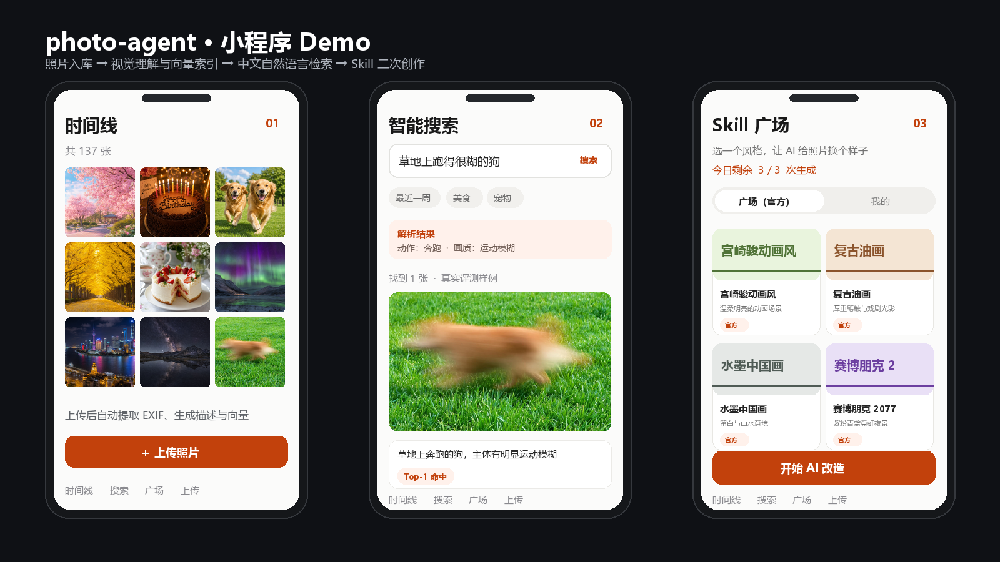
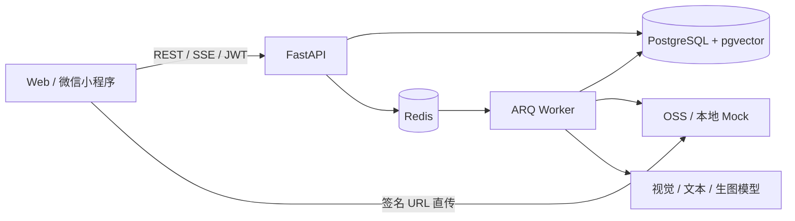

# Photo Agent

面向中文照片场景的 AI 照片管家：上传、理解、自然语言查找照片，并在明确确认后进行图像创作。

项目包含 Web 和微信小程序客户端、FastAPI 服务、PostgreSQL/pgvector、Redis/ARQ Worker，以及可切换的对象存储和模型适配器。本地可用 Mock OSS 与 Mock AI 跑通主要工程流程；真实模型效果需要单独评测。



> 图片依据仓库中的小程序页面合成，素材和查询来自评测集，并非线上产品截图。

## 项目状态

**当前处于评测与调优阶段，尚未通过生产发布验收。** Web 账号密码注册/登录已在开发代码中实现；部署时需先执行最新数据库迁移。Web 账号与微信账号独立，不会按昵称合并照片。详情见 [Web 认证说明](docs/32-web-authentication.md)。

2026-09-12 的真实模型回归复测使用已见过的数据：Agent 默认配置和 V2 对照在各 48 次场景重复中均通过；检索在 40 张图、80 条查询上得到 Recall@5 91.18%，12 条无正例查询中只有 4 条完成了正确的无结果确认，另有 11/80 次核验未完成。这是限定场景的回归结果，不是独立盲测、完整产品链路或生产质量证明。测试配置、费用、失败样例和局限见 [当前模型复测](docs/33-current-model-retest.md)；发布阻塞见 [发布质量复核](docs/23-release-quality-review.md)。

## 主要能力

| 能力 | 当前实现 |
| --- | --- |
| 照片管理 | 签名 URL 直传、用户内去重、异步 EXIF/缩略图/视觉理解、时间线 |
| 中文检索 | 自然语言条件、向量与结构化召回、文本核验、分页和无结果处理 |
| Photo Agent | 有限步工具调用、选图、澄清、SSE 进度、状态与费用预算守卫 |
| 图像创作 | 官方及私有 Skill、创作方案、用户确认、异步生成与失败恢复 |
| 客户端 | Web 和微信小程序；Web 支持账号密码，微信仍使用独立登录入口 |
| 工程设施 | Alembic 迁移、隔离测试、结构化日志、Trace 和健康检查 |

付费生成采用准备、摘要、确认、幂等执行的流程。权限、照片归属和调用预算由服务端确定性代码检查。架构与行为细节从 [文档中心](docs/README.md) 阅读。

## 本地启动

需要 Docker Desktop 或 Docker Engine（含 Compose v2）。首次构建会下载镜像和依赖，耗时取决于网络。以下为开发环境，基础 Compose 带热更新、默认口令和开放端口，不适合直接暴露到公网。

### 1. 启动 API、Worker 与依赖

```bash
test -f .env || cp .env.example .env
docker compose up -d --build
docker compose exec api alembic upgrade head
docker compose restart api worker
curl http://localhost:8000/ready
```

PowerShell 可将第一行换成 `if (-not (Test-Path .env)) { Copy-Item .env.example .env }`，最后一行换成 `Invoke-RestMethod http://localhost:8000/ready`。如本地已有 `.env`，保留原配置，并核对新增加的配置项。`/ready` 的数据库和 Redis 状态应为 `ok`；API 文档位于 <http://localhost:8000/docs>。

### 2. 启动 Web

```bash
cd web
npm ci
test -f .env.local || cp .env.example .env.local
npm run dev
```

需要 Node.js 22.13+。PowerShell 可将复制命令换成 `if (-not (Test-Path .env.local)) { Copy-Item .env.example .env.local }`。浏览器打开 <http://localhost:3001/login>，注册一个 Web 账号即可进入应用。`WEB_REGISTRATION_ENABLED=false` 会关闭新注册，已有账号仍能登录。页面的开发态微信 Mock 入口默认隐藏；如需启用，参见 [Web 认证说明](docs/32-web-authentication.md)。

也可用 Compose 启动 Web 和 Nginx 网关，默认访问 <http://localhost:8080>：

```bash
docker compose -f docker-compose.yml -f docker-compose.web.yml up -d --build
docker compose -f docker-compose.yml -f docker-compose.web.yml exec api alembic upgrade head
```

微信小程序的导入和调试步骤见 [小程序 README](miniprogram/README.md)。本地 Mock OSS/AI 只验证工程链路；接入真实 OSS、DashScope 或 OpenAI 时按 [配置与部署](docs/08-configuration-and-deployment.md) 设置密钥和网络边界。

## 技术结构


```mermaid
flowchart LR
    C[Web / 微信小程序] -->|REST / SSE / JWT| A[FastAPI]
    C -->|签名 URL 直传| O[OSS / 本地 Mock]
    A --> P[(PostgreSQL + pgvector)]
    A --> R[(Redis)]
    R --> W[ARQ Worker]
    W --> P
    W --> O
    W --> M[视觉 / 文本 / 生图模型]
```

| 目录 | 内容 |
| --- | --- |
| `app/` | API、权限、Agent、检索、生成和 Worker |
| `alembic/` | 数据库迁移 |
| `web/` | Web 客户端及浏览器测试 |
| `miniprogram/` | 微信小程序 |
| `tests/`、`scripts/` | 自动化测试与评测工具 |
| `docs/` | 产品、技术、评测和部署文档 |

## 验证

```bash
ruff check app tests scripts
pytest -q
python scripts/offline_eval.py --validate-only

cd web
npm run check
```

VL 评测集校验需要另行恢复本地测试照片；新检出仓库不包含这些图片。浏览器 E2E 需先启动隔离的 Compose 测试环境，再执行 `npm run test:e2e`；运行方式见 [测试与评测](docs/10-testing-and-evaluation.md)。真实模型和检索评测有独立的数据、费用与结果边界，不能用 Mock 测试通过代替质量验收。

## 文档入口

- [文档中心](docs/README.md)：架构、API、客户端、部署与运维索引。
- [测试与评测](docs/10-testing-and-evaluation.md)：测试入口与评测边界。
- [当前模型复测](docs/33-current-model-retest.md)：最近一次真实模型回归及问题。
- [仓库发布文件范围](docs/31-repository-publishing.md)：GitHub 中保留的源码和本地数据边界。

真实 `.env`、密钥和用户照片不要提交到仓库。上线前还需完成生产配置、HTTPS、迁移、真实服务验证和发布 Gate；当前状态不构成上线承诺。
