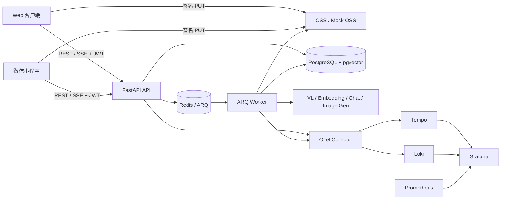
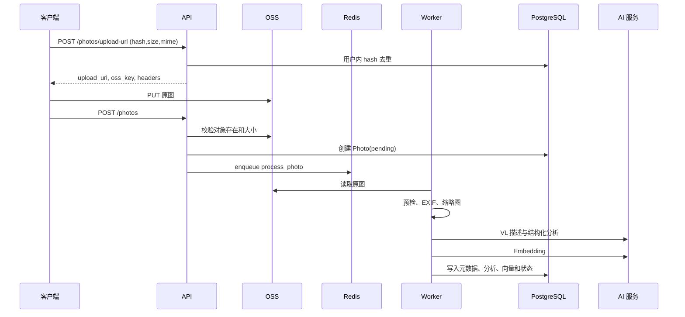

# 架构蓝图

## 1. 系统边界

应用不托管对象存储本身。Mock 模式仅把对象写入 API 与 Worker 共享卷，模拟真实 OSS 的
签名上传和读取语义。

## 2. 逻辑分层

| 层 | 责任 | 典型目录 |
| --- | --- | --- |
| 客户端 | 页面、会话保存、上传、轮询、SSE 消费 | `web/`、`miniprogram/` |
| API | 认证、参数校验、资源所有权、协议转换 | `app/api/`、`app/schemas/` |
| Agent 编排 | 意图解析、状态机、LLM 决策、工具策略、会话 | `app/services/agent*.py` |
| 领域服务 | 搜索、OSS、AI、生成、质量门禁、推荐 | `app/services/` |
| 异步执行 | 照片处理、Embedding 重试、生成、画像、归档 | `app/workers/` |
| 数据 | ORM、pgvector、事务和迁移 | `app/models/`、`alembic/` |
| 平台 | 日志、Trace、熔断、容器和监控 | `app/core/`、`observability/` |

依赖方向通常为客户端 → API → 服务 → 数据/外部服务。Worker 与 API 共享领域服务和 ORM，
但通过 Redis 任务边界解耦耗时操作。

## 3. 启动与生命周期

`app/main.py` 创建 FastAPI 应用并完成以下工作：

1. 初始化日志和 OpenTelemetry。
2. 注册 LogID 中间件、CORS 与统一异常处理。
3. 挂载业务路由和 FastAPI 自动埋点。
4. 启动时同步官方 Skill，并初始化可热刷新的 Skill/Prompt 注册表。
5. 暴露 `/live`、`/ready`、`/health`。

Worker 由 `arq app.workers.tasks.WorkerSettings` 启动，默认 `max_jobs=4`、任务超时
180 秒、结果保留 600 秒、最多尝试 2 次。

## 4. 照片入库数据流

## 5. 搜索数据流

1. `SearchQuery` 校验结果模式、日期、结构化条件和权重。
2. 可选 `auto_parse` 将中文查询解析为日期、地点和标签。
3. 查询文本 Embedding 使用 Redis 缓存。
4. pgvector 召回当前用户的可检索照片，并应用时间/标签/JSONB/语义分面过滤。
5. 计算语义、新鲜度、交互/画像组合分数。
6. 对可见文字、品牌、数值、日期、路线等执行强约束证据校验。
7. 可选 Top-K 文本判同；必要且配置开启时，再进行原图视觉核验。
8. 根据 `browse`、`best` 或 `select` 裁剪结果并返回索引覆盖率。

## 6. Agent 数据流

Agent 在 HTTP 层取得用户级 Redis 锁，加载或创建 `AgentSession`，然后执行规则快路径、
候选池续搜或 LLM 工具循环。每一步受步数、搜索次数、澄清次数、总时长、Token、费用和
单工具超时约束。状态和自然语言短期记忆保存到 PostgreSQL；候选预取池保存在 Redis。

## 7. 生成数据流

生成采用两阶段协议：

1. `prepare_generation` 校验照片和 Skill 权限，创建 `awaiting_confirmation` 任务，返回
   一次性确认 token、估算费用和过期时间。
2. `confirm_generation` 在行锁内校验 token/过期时间，原子预占每日额度并入队。
3. Worker 调模型、保存结果、消费预占额度并增加 Skill 使用次数；失败时按错误类型重试或
   释放额度。

## 8. 外部依赖与降级

| 依赖 | 失败策略 |
| --- | --- |
| PostgreSQL / Redis | `/ready` 返回 503；业务无法安全继续 |
| OSS | 熔断器保护；对象不存在属于不可重试业务错误 |
| VL | 保存 EXIF/缩略图，状态可降级为 `partial_done` |
| Embedding | 独立延迟重试，不重复调用已成功的 VL |
| 文本重排/视觉核验 | 返回降级元数据，避免把不可用误报为确定判定 |
| 图像生成 | ARQ 最多尝试 2 次；最终失败释放预占额度 |

## 9. 架构约束

- 不在日志或 Trace 中记录图片内容、用户原始问题、Prompt 或第三方签名查询参数。
- 新增耗时外部调用应接入对应熔断器、超时和结构化指标。
- 新增 Worker 任务必须放入 `WorkerSettings.functions`，并通过 `traced_job` 包装。
- 新增资源查询必须显式包含 `user_id` 所有权过滤，不能只按资源 ID 查询。
- ORM 变更必须由 Alembic 迁移落地；不要依赖 `create_all` 替代生产迁移。
