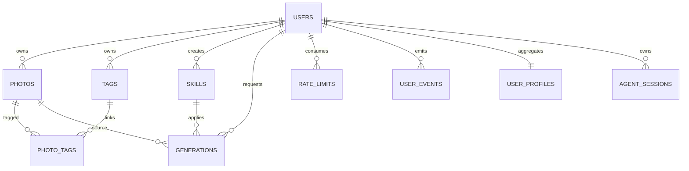

# 数据库 Schema

## 1. 技术与迁移

- 数据库：PostgreSQL 16。
- ORM：SQLAlchemy 2 异步模式，驱动为 `asyncpg`。
- 向量：`pgvector`，照片和用户风格向量均为 1024 维。
- 迁移：Alembic；当前迁移链从 `20260806_0001` 到 `20260822_0002`。

生产环境升级命令：

```bash
docker compose exec api alembic upgrade head
```

## 2. 实体关系



## 3. 核心表

### `users`

微信身份与用户资料。`wechat_openid` 唯一且有索引；JWT 的 `sub` 存储 `users.id`。

### `photos`

| 字段组 | 关键字段 |
| --- | --- |
| 所有权/存储 | `user_id`、`oss_key`、`thumb_key`、`hash`、`size_bytes`、`mime_type` |
| 图片元数据 | `width`、`height`、`taken_at`、`location` |
| AI 产物 | `ai_description`、`ai_analysis`、`embedding vector(1024)` |
| 集合检索分面 | `photo_type`、`is_selfie`、`people_count` |
| 处理状态 | `status`、`partial_reason` |
| Embedding 重试 | `embedding_retry_count`、`embedding_next_retry_at`、`embedding_last_attempt_at`、`embedding_last_error` |

唯一约束 `uq_photos_user_hash(user_id, hash)` 保证同一用户内去重，不阻止不同用户上传相同文件。

照片处理状态：

```text
pending -> processing -> done
                    -> partial_done
                    -> skipped
                    -> failed
```

面向客户端的搜索索引状态由 ORM 属性计算，取值为 `ready`、`indexing`、`retrying`、
`service_busy` 或 `unavailable`。

### `tags` / `photo_tags`

`tags` 以 `(user_id, name)` 唯一；`photo_tags` 为照片与标签的复合主键关联表，`source`
记录标签来自 AI 或用户。

### `skills`

官方与用户自建的生成配方。`owner_id=NULL` 表示官方 Skill；`is_public` 控制广场可见性，
`is_official` 控制只读行为。`reference_keys` 为 JSONB 对象键列表，模型限于
`wanx2.1-imageedit` 与 `gpt-image-2`。

### `generations`

记录一次图片改造及其安全协议：

- `(user_id, idempotency_key)` 唯一，避免重复准备。
- `confirmation_token` 唯一，`confirmation_expires_at` 控制确认窗口。
- `quota_reserved` 与 `quota_reserved_day` 支撑额度预占/释放/消费。
- `enqueue_status` 区分 `not_queued`、`enqueueing`、`queued`、`failed`、`consumed`。
- `attempt_count` 与 `last_error_code` 支撑重试和运维诊断。

常见状态：`awaiting_confirmation`、`pending`、`queue_failed`、`processing`、
`retryable_failed`、`done`、`failed`。

### `rate_limits`

复合主键 `(user_id, day)`。`gen_count` 是已消费次数，`gen_reserved` 是已确认但未完成的预占；
二者之和受 `GEN_DAILY_FREE_QUOTA` 约束。

### `user_events` / `user_profiles`

事件表记录 `generation_complete`、`search_click`、`skill_browse`、`photo_interact` 等行为，
Payload 使用 JSONB。画像表聚合 Skill/标签亲和度、1024 维风格分布和累计次数。

### `agent_sessions`

保存 Agent JSONB 状态、用户、会话状态和过期时间。Redis 锁不存入该表；锁只负责防止同一
会话并发执行。

## 4. 索引策略

- 用户所有权、照片状态、拍摄时间、生成状态和事件类型均有 B-tree 索引。
- `photos.embedding` 使用向量索引（迁移中定义），向量维度必须与 Embedding 模型一致。
- `photos.ai_analysis` 使用 JSONB 查询；高频集合条件另投影到独立列并建索引。
- 新增向量模型时不能只改配置，必须同时迁移列维度并重建全部向量。

## 5. 删除策略

- 用户删除后，照片、标签、事件、画像、会话等通过外键 `CASCADE` 清理。
- 生成记录的源照片和 Skill 使用 `SET NULL`，保留生成审计记录。
- 删除照片的对象存储清理与数据库删除必须保持可重试，避免留下不可定位的孤儿对象。

## 6. 迁移纪律

1. 修改 ORM 后新增 Alembic revision，不修改已发布迁移。
2. 同一发布先执行迁移，再滚动启动 API/Worker。
3. 对新增非空列使用“可空/默认值 → 回填 → 收紧约束”的渐进式迁移。
4. 向量或 JSONB 大规模回填通过 Worker 批处理，不在单次迁移事务中调用外部 AI。
5. 回滚前确认新代码没有写入旧 Schema 无法表示的数据。
