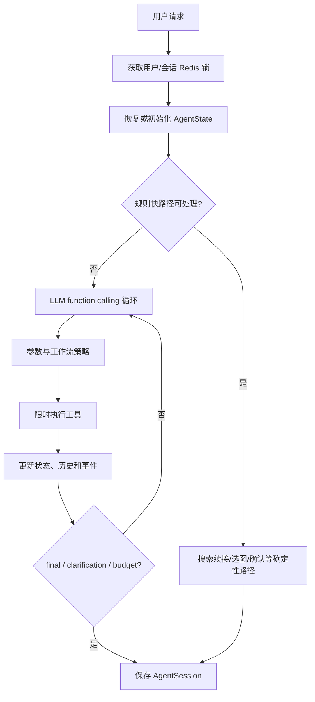

# Agent 系统

## 1. 目标与边界

Photo Agent 是单层 LLM 编排器，而不是多 Agent 系统。它负责把用户自然语言映射为少量业务工具，
并由确定性代码执行权限、状态、预算和参数策略。LLM 不直接访问数据库、Redis 或 OSS。

入口：

- `POST /agent/run`：返回事件数组、状态和会话状态。
- `POST /agent/stream`：通过 SSE 增量返回同一执行过程。

## 2. 模块划分

| 模块 | 责任 |
| --- | --- |
| `agent.py` | `PhotoAgent` 门面与依赖组装 |
| `agent_runtime.py` | 初始化、规则路由、候选续搜、LLM 循环 |
| `agent_execution.py` | 参数解析、工具策略、超时、调用与状态回写 |
| `agent_registry.py` | Tool Schema 与函数注册 |
| `agent_state.py` | 约束和可序列化运行状态 |
| `agent_workflow.py` | 搜索/选图/生成的显式状态转换守卫 |
| `agent_intent.py` | 结果数量、完整结果集和追问类型识别 |
| `turn_resolver.py` | 规则优先的多轮意图解析，必要时用 LLM |
| `agent_messages.py` | 工具结果压缩与面向用户的安全消息 |
| `search_candidate_pool.py` | Redis 候选预取池、状态和 Trace 上下文 |

## 3. 工具集

| 工具 | 用途 | 主要约束 |
| --- | --- | --- |
| `search_photos` | 自然语言和结构化条件搜索 | 最多搜索 2 次；尊重结果模式和完整集要求 |
| `browse_candidates` | 搜索失败后让用户自行浏览 | v2 不直接暴露给模型，由代码调用 |
| `fallback_search` | 线索相册 → 时间线 → 全相册三级兜底 | v2 不直接暴露给模型 |
| `ask_clarification` | 提出问题并暂停等待用户 | 最多澄清 2 次 |
| `apply_skill` | 准备图像生成 | 需要选定照片；v2 返回确认摘要而不直接入队 |
| `get_photo_detail` | 读取单张照片完整信息 | v2 不直接暴露给模型 |
| `recommend_skills` | 根据画像与照片推荐 Skill | 只返回用户可见 Skill |
| `final_answer` | 伪工具，提交最终答复 | 由执行器拦截，不调用外部函数 |

v2 向模型只暴露 `search_photos`、`ask_clarification`、`apply_skill` 和
`recommend_skills`，把浏览、详情和兜底降为内部实现，缩小决策空间。

## 4. 执行顺序



规则层优先处理明确的搜索、选中候选、确认生成和已知追问，减少 LLM 延迟与漂移。只有复杂或
非搜索请求才进入 LLM 路径。

## 5. 工作流状态机

```text
idle
 ├─> searching ─> results_ready ─> selection_confirmed
 │                 └─> awaiting_selection ─> selection_confirmed
 └─> selection_confirmed

selection_confirmed / results_ready
 └─> awaiting_generation_confirmation ─> generation_queued

任意主要状态可在允许路径上进入 failed；failed 可回到 searching 或 idle。
```

所有转换通过 `transition_workflow` 校验。调用者不得直接把任意字符串写入
`workflow_state`。

## 6. 会话与记忆

`AgentState` 保存：

- 当前会话/用户、原始问题、Agent variant。
- 步数、搜索次数、澄清次数和被用户拒绝的照片 ID。
- 已确认照片/生成任务、最近搜索结果。
- 最近自然语言消息、会话摘要、活动意图和可信搜索状态。
- 兜底级别、Token/费用累计和决策历史。

会话 JSONB 存入 `agent_sessions`，默认续接窗口约 10 分钟。锁状态不持久化；Redis 锁 TTL
默认 30 秒，用于阻止并发修改同一会话。

## 7. 预算与安全护栏

默认 `AgentConstraints`：

| 约束 | 默认值 |
| --- | ---: |
| 最大步骤 | 8 |
| 最大搜索次数 | 2 |
| 最大澄清次数 | 2 |
| 总时长 | 60 秒 |
| 总 Token | 20,000 |
| 总费用 | 1 元 |
| 单工具超时 | 15 秒 |

配置可覆盖时长、Token、费用和工具超时。达到预算后必须终止循环并产生明确事件，不能继续
隐式调用模型或工具。

## 8. 灰度路由

`agent_variant_for_user` 使用 `SHA-256(salt:user_id) % 100` 做稳定分桶：

1. `AGENT_V2_KILL_SWITCH=true` 或 `AGENT_V2_ENABLED=false` 时始终为 `control`。
2. 否则桶号小于 `AGENT_V2_ROLLOUT_PERCENT` 的用户进入 `v2`。
3. 修改 salt 会重新分桶，应视为发布行为。

## 9. SSE 事件

SSE 包含开始、模型/工具过程、最终答复、完成和错误事件。服务端在后台任务结束时追加
`done`，异常时发送结构化 `error`。客户端必须同时处理 HTTP 层错误和流内错误。

当前结果负反馈走独立的 `result_feedback` 路由：用户明确给出序号、唯一的“这张”，或已经
确认的照片时，服务端把该 ID 写入当前搜索的排除集合，并发送 `feedback` 事件让客户端即时
移除对应卡片。对象不唯一时只发送 `clarify`，不能猜测。新搜索或替换搜索的 `route.relation`
为 `new` / `replace`，客户端收到路由事件就清空旧结果，不等待下一次工具结果返回。

负反馈只以 `agent_feedback` 用户事件保存结构化字段：受控照片 ID、是否续搜、剩余数量和
搜索词指纹；不保存用户原话，也不自动写入长期偏好。

## 10. 扩展规则

- 新增工具时同时定义 JSON Schema、函数、超时、权限策略、状态回写和测试用例。
- 工具输出给 LLM 前应压缩和脱敏，不能把签名 URL、异常正文或整张分析 JSON 无限制注入。
- 业务幂等与权限由工具实现，不依赖模型“记得”执行。
- 新增状态时同步更新状态集合、允许转换、持久化恢复和客户端渲染。
- 高成本动作应使用“准备 → 展示摘要 → 用户确认 → 执行”的协议。
