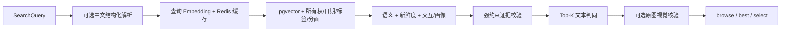

# 照片处理与检索

## 1. 上传协议

上传使用三段式协议：

1. 客户端计算 SHA-256、文件大小和 MIME，调用 `/photos/upload-url`。
2. 客户端用响应中的方法和 headers 直传对象存储。
3. 客户端调用 `POST /photos`，API 对 OSS 对象存在性/大小做服务端校验，再创建记录并入队。

这避免 API 转发大文件，也允许同一用户通过 `(user_id, hash)` 提前去重。签名 URL 和对象键
均是短期/敏感信息，不应写入日志或遥测。

## 2. 照片处理流水线

`process_photo` 的阶段：

1. 校验状态转换并写入 `processing`。
2. 从 OSS 读取原图；对象缺失属于不可重试错误。
3. 本地预检；不合格图片写入 `skipped` 和原因码。
4. 提取 EXIF/GPS，规范方向并生成最长边 512 的 JPEG 缩略图。
5. 上传缩略图。
6. 调 VL 生成中文描述和结构化 `ImageAnalysis`。
7. 将描述与细粒度字段展开为检索文本，调用 1024 维 Embedding。
8. 运行质量门禁，决定保存描述、结构化分析和向量的层级。
9. 回写 `done`、`partial_done` 或 `failed`，必要时安排仅 Embedding 的延迟重试。

VL 降级时仍保留 EXIF 和缩略图；Embedding 失败不会重复调用已成功的 VL。

## 3. Embedding 重试

默认最多 5 次真实调用（首次 + 4 次重试），延迟为 2、8、25、60 秒，均从上一次实际失败
结束后开始计算。熔断器 OPEN/HALF_OPEN 拒绝调用时不增加真实尝试次数。

相关状态：

- `embedding_retry_count`：已经发生的真实失败次数。
- `embedding_next_retry_at`：下一次计划时间。
- `embedding_last_attempt_at`：上次真实调用时间。
- `embedding_last_error`：稳定错误码/异常类型，不保存第三方响应正文。

手动恢复入口为 `POST /photos/{id}/retry-search-index`。

## 4. 结构化视觉字段

`ai_analysis` 包含场景、人物、物体、图片文字、情绪、颜色和摘要等字段。为支持“全部自拍”、
“所有截图”或“至少三个人的合照”这类集合查询，以下高频字段独立投影并建索引：

- `photo_type`：`selfie`、`screenshot`、`group_photo`、`portrait`、`document`、
  `food`、`scenery`、`other`。
- `is_selfie`。
- `people_count`。

集合查询应优先使用硬过滤；近似向量召回不能证明“全部”。

## 5. 搜索阶段

### 5.1 查询解析

`auto_parse=true` 时，服务端解析自然语言中的日期、地点和标签。规则解析用于常见中文表达，
复杂情况可调用 LLM。显式请求字段优先于自动推断。

### 5.2 召回与打分

语义分数由余弦距离转换；新鲜度默认使用 30 天半衰期；交互分数可结合事件和用户画像。
三个权重会归一化，不要求调用方之和等于 1。

全局相似度硬阈值默认关闭（0）。显式阈值或环境阈值会过滤候选，但完整集合查询可按可靠性
规则绕过阈值，以避免漏掉满足硬条件的照片。

### 5.3 强约束校验

`search_constraints.py` 从查询抽取可见文字、品牌、数字、日期、路线、座位/站点和物体等强约束，
再对候选的结构化分析和描述做证据判定。响应只返回统计，不泄露被过滤照片的内容或 ID。

### 5.4 文本重排

默认开启 Top-K 查询—候选判同，缓存默认 7 天。判定为 match、uncertain 或 contradiction；
`SEARCH_RERANK_REQUIRE_MATCH=true` 时，零明确匹配可导致整页拒识。超时或模型故障会在
`rerank_check` 中标记 degraded。

### 5.5 原图视觉核验

默认关闭。满足低置信、分差过小或细粒度查询等触发条件时，对有限候选使用短期签名原图 URL
复核。配置项控制 Top-K、分差、超时、缓存和图片 URL TTL。

## 6. 结果模式

| 模式 | 语义 |
| --- | --- |
| `browse` | 面向浏览，业务最多返回 5 张 |
| `best` | 对候选比较后返回最佳 1 张 |
| `select` | 用户自行选择，可尊重指定数量 |
| `select + complete_result_set` | 扫描并返回满足可靠硬条件的完整结果集 |

完整结果响应通过 `total_matches`、`result_set_complete`、`completeness_reason` 和 `truncated`
表达语义；客户端不能只看当前页数量。

## 7. Agent 候选池

Agent 首次搜索后可异步预取最多 12 个已验证候选放入 Redis，默认 TTL 10 分钟。追问优先从
候选池取，降低重复检索和视觉核验成本。状态键和 Trace 上下文与候选列表分离保存。

## 8. 维护注意事项

- 更换 Embedding 模型需要同步维度、迁移、重索引和检索阈值评测。
- 修改 VL Schema 时同步 `ImageAnalysis`、质量门禁、分面投影和历史数据回填。
- 修改搜索拒识策略时分别观察 Recall、Precision、零结果准确率、延迟和视觉调用比例。
- 评测数据必须隔离 development/validation/test，不能用已查看的 Test 反复调参。
