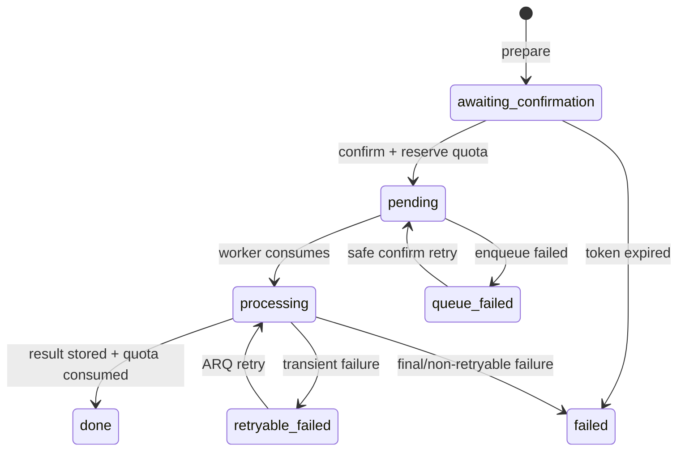

# Skill 与图像生成

## 1. Skill 模型

Skill 是图像改造配方，包含名称、说明、Prompt、参考图对象键、封面、模型、功能模式、强度和
可见性。

| 属性 | 规则 |
| --- | --- |
| 所有者 | `owner_id=NULL` 表示官方；否则为用户自建 |
| 可见性 | 官方、公开或本人所有可读取 |
| 可写性 | 只能修改/删除本人非官方 Skill |
| 模型 | `wanx2.1-imageedit` 或 `gpt-image-2` |
| function | `description_edit`、`stylization_all`、`stylization_local` |
| strength | 0.0–1.0 |
| 参考图 | 最多 8 个 OSS key |

官方 Skill 来自 `app/data/official_skills.json`，API 启动时 upsert。更新时保留 `use_count`，
并避免覆盖同名用户 Skill。

## 2. 两阶段生成协议

生成不能从单个 HTTP 请求直接扣额度并调用模型。



### 2.1 Prepare

`POST /photos/{photo_id}/generate`：

- 校验照片属于当前用户。
- 校验 Skill 可见性。
- 按 Skill 或请求选择模型。
- 以 `(user_id, idempotency_key)` 实现幂等。
- 创建 `awaiting_confirmation`，返回确认 token、估算费用和过期时间。

### 2.2 Confirm

`POST /generations/{id}/confirm` 在数据库行锁内：

- 校验任务所有权和确认 token。
- 检查 token 是否过期；默认窗口 10 分钟。
- 原子预占当日额度。
- 把状态设为 `pending/enqueueing` 后尝试入队。
- 入队失败保留任务和预占信息，返回 503，允许安全重试。

重复确认已入队/处理中/已完成任务会返回同一记录。

## 3. Worker 执行

`generate_photo`：

1. 行锁读取任务并校验状态，增加 `attempt_count`。
2. 读取源照片和 Skill。
3. 拼接 Skill Prompt 与 `extra_prompt`。
4. 为源图和参考图生成 30 分钟签名 URL。
5. 经图像生成熔断器调用模型。
6. 将 URL 或 Base64 结果统一为 bytes，保存到 OSS。
7. 同一事务写入结果、真实费用、消费预占额度并增加 Skill 使用次数。
8. 记录 `generation_complete` 用户事件。

输出对象键格式为 `generations/{user_id}/{YYYY/MM/DD}/{uuid}.{ext}`。

## 4. 额度一致性

`rate_limits.gen_reserved` 防止用户并发确认多个任务绕过每日限制。成功完成时将预占转为
`gen_count`；最终失败或不可重试失败释放预占。默认免费额度为每天 3 次。

以下字段应一起观察：

```text
gen_count + gen_reserved <= GEN_DAILY_FREE_QUOTA
```

若进程在关键事务间崩溃，运维应检查长期停留在 `enqueueing`、`processing` 或仍持有
`quota_reserved=true` 的记录。

## 5. 重试与错误分类

- 源照片不存在等业务错误：不可重试，写 `failed` 并释放额度。
- 网络、模型、下载或 OSS 临时故障：第一次写 `retryable_failed` 并交给 ARQ 重试。
- 最终尝试仍失败：写 `failed`、稳定 `last_error_code`，释放额度。
- 客户端只展示安全的通用错误；详细异常进入受控日志，不进入公开 API。

## 6. 模型适配

`image_gen.generate` 统一通义万相与 OpenAI Images 的差异：

- 万相通常返回临时结果 URL。
- OpenAI 适配器可返回 Base64 bytes。
- Mock 模式复用源图完成协议闭环，不代表生成质量。
- 通义万相的 reference 支持边界与 OpenAI 不同，扩展前应单独校验。

## 7. 发布检查

- 新增模型时同步 Schema 正则、Skill 表约束、适配器、费用估算和客户端选项。
- 修改免费额度前检查已有预占任务，避免额度口径瞬间变化。
- 修改确认 TTL 时同时检查 Web 和小程序轮询/确认交互。
- 修改 Prompt 或官方 Skill 后通过注册表热刷新或重启 API 生效，并记录发布原因。
