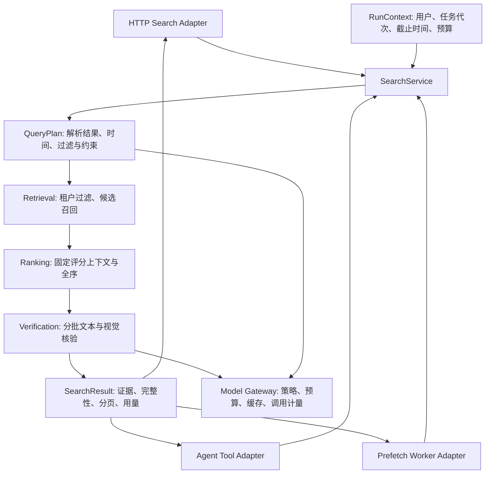

# Photo Agent 优化方案

建议先修复安全边界和任务所有权，再把两套搜索实现收敛到唯一服务；基础 Python CI 从第一批开始，质量评测贯穿改造全过程。保留现有单 Agent、FastAPI、PostgreSQL/pgvector、Redis/ARQ，不引入新的编排框架或微服务。

## 1. 范围与证据基线

- 日期：2026-09-05；代码基线：本地 `main`，`d2983f1725200bdb50ead9558a4d0331e597ee83`（部分修复），开始检查时工作区干净。与用户提供意见的提交一致；本轮未 fetch，不声称这是 GitHub 此刻最新提交。
- 输入：用户提供的复核意见；范围为其中列出的主要问题和关联调用链，不等同于复核未提供的完整“95 条”原报告。
- 方法：静态阅读后端、Worker、客户端、Schema、迁移与 CI；核对本地 ARQ 0.26.1 实现及 FastAPI 官方依赖生命周期说明；运行现存 Python 测试和 Ruff。
- 实测：`.venv/Scripts/python.exe -m pytest -q` 为 **10 passed**；`ruff check app tests scripts --output-format concise` 为 **6 个 F401**。历史账本的“7 个 Ruff 错误”不能作为当前数量。
- 限制：未运行真实模型、数据库查询计划、故障注入、浏览器切号复现、Web/E2E、迁移或负载测试；以下性能收益和故障后果除明确标注外均是待验证判断。
- 治理：沿用 `.project-to-act` Managed 模式；本轮任务 `S6-OPT-001` 仅负责方案。阶段 6 保持 `in_progress`、生命周期 revision 4，原发布阻塞结论保持有效。实施责任人由项目所有者分配。

## 2. 对审查意见的取舍

下表的文件行号对应本次提交。严重度按对外部署设计；Mock 的风险需结合实际暴露方式判断。

| 主题 | 当前代码证据 | 方案判断 |
| --- | --- | --- |
| Admin 鉴权 | `app/api/admin.py:24`，`app/api/__init__.py:17` | P0。客户端 `dev_mode` 可放行，生产分支也直接成功，应用必须自行认证与授权。 |
| Mock OSS | `app/api/_oss_mock.py:14`，`app/services/oss.py:34`、`:201`、`:214` | 公网生产实例误入 Mock 时为 P0；隔离开发环境仍需路径与容量限制。生产缺少 OSS 配置不能静默降级到 Mock。 |
| SSE 与 DB | `app/api/agent.py:174`、`:214`、`:216`，`app/database.py:36` | P1。runner 捕获请求级 Session，生成器缺少异常/断线清理。独立 Session 与取消传播一起修。 |
| 锁丢失 | `app/services/lock.py:132`，`app/api/agent.py:109`，`app/services/session.py:51` | P1。续期失败停止续期循环，运行与最终保存仍可继续；Redis 所有权检查之外还需持久化写入防护。 |
| Worker 孤儿任务 | `app/workers/tasks.py:247`、`:473`、`:566`，`app/services/quality.py` 的 `VALID_TRANSITIONS` | P1。缺少处理租约与 stale recovery。仅增加 `processing → processing` 会允许重复执行，不能作为恢复方案。 |
| Worker 重试 | `app/workers/tasks.py:473`；本地 ARQ 0.26.1 `worker.py:603` | 补充 P1。普通异常最终失败；`max_tries` 是重试上限，普通 `raise` 不会自动获得预期重试，需明确错误分类与 `Retry`。 |
| 视觉策略 | `app/config.py:82`、`:91`，`app/services/search_reranker.py:506`、`:592` | 接受行为判断，表述为两套策略冲突。前台关闭视觉核验仍允许后台触发；建立一个最高优先级的费用开关。 |
| 精排不补位 | `app/services/search_reranker.py:558`、`:577`、`:673` | 普通 strict 路径成立；候选池分批核验已存在。统一分批核验，不将后续未核验照片直接当作匹配补回。 |
| 重复 parse | `app/services/agent_tools.py:806`、`:825`，`app/services/agent_runtime.py:184` | 局部成立。高置信度 fast path 已关闭重复 parse；fallback、直接续搜、prefetch 仍需要统一复用解析结果。 |
| 双搜索实现 | `app/api/search.py:66`，`app/services/agent_tools.py:161` | 核心结构问题。现有公共评分函数值得复用，但两入口仍各自编排完整管线。 |
| 小程序三处契约问题 | `miniprogram/utils/api.js:32`、`:129`，`miniprogram/pages/skill-edit/index.js:14`，`app/schemas/skill.py:16` | CRLF 分帧、非法默认模型、过期 token 清理均成立，作为可独立交付的修复。 |
| Web 用户缓存 | `web/components/auth-gate.tsx:31`，`web/app/providers.tsx:11`，`web/features/photos/photos-page.tsx:44` | `/auth/me` 问题成立；照片、额度、生成历史也有固定 key。修复范围扩大到所有用户数据缓存，按 P1 处理客户端隔离；不声称服务端越权已发生。 |
| 分页 | `app/api/search.py:241`、`:341`，`app/services/agent_tools.py:384`、`:522`，`app/services/search.py:406` | 不止同分排序：普通两入口始终返回 `next_cursor=None`；相册 fallback 实际生成 cursor。还需解决动态评分和精排后顺序与 cursor 的一致性。 |
| 时间与画面日期 | `app/services/query_parser.py:96`、`:171`，`app/services/search_constraints.py:170`，`app/api/search.py:112` | 解析“今天”和 SQL 日期边界都按 UTC，必须一起改；拍摄日期与图中文字日期需要不同约束类型。 |
| Prefetch 代次 | `app/services/search_candidate_pool.py:19`，`app/workers/search_tasks.py:28`、`:76` | 提前到一致性改造：同 session 清空后重用同一 key，旧任务仍能回写旧结果；不是纯性能问题。 |
| `apply_skill` 参数 | `app/services/agent_execution.py:68`，`app/services/agent_registry.py:264` | 将容错解析的 `prompt` 改为契约中的 `extra_prompt`，随后再过 Schema；不靠容错猜测缺失的关键 ID。 |
| ANN / 相册物化 | `alembic/versions/20260806_0001_initial_schema.py:105`，`app/services/search.py:434` | HNSW 已在迁移中存在，待确认实际数据库是否应用及是否使用。真正确定的热点是相册全量 ORM 物化与 Python 计算。 |
| CI / 评测 | `.github/workflows/web-ci.yml:5`、`:61`，`tests/` | 已有 Web 与后端共同运行的 E2E，缺独立 Python gate。触发路径还漏 `app/models/**`、`app/core/**`、迁移、requirements 和 Python 测试等。 |

## 3. 目标架构与边界

建议新增少量职责明确的模块，避免一次性改目录结构：

| 建议模块 | 责任 | 复用对象 |
| --- | --- | --- |
| `app/services/search_contracts.py` | 内部 `SearchRequest`、不可变 `QueryPlan`、`SearchResult`、`SearchPolicy`；不直接接收客户端可控的用户身份/预算权限 | `app/schemas/photo.py` 的外部模型由 Adapter 转换 |
| `app/services/search_engine.py` | 唯一搜索编排，处理模式、候选批次、停止原因和分页 | `search.py` 的纯函数、constraints、reranker、index 服务 |
| `app/services/search_repository.py` | 用户隔离、向量召回、结构化浏览、字段投影与排序上下文 | 两份现有 SQL 统一到此 |
| `app/services/run_context.py` | 任务 ID、取消、deadline、所有权代次、预算引用；不持有共享 AsyncSession | API runner、Worker、Agent 工具执行 |
| 模型服务的公共调用包装层 | 供应商适配之外统一限额、usage、价格版本、错误和缓存版本 | 现有 `ai.py`、query parser、两个 verifier、熔断器与 OTel |

`search_photos()` 保留为兼容 Agent 工具名称的薄适配器；HTTP 适配器只负责认证、校验和序列化。普通搜索、Agent 和预取可使用不同的声明式策略，但不能再各写一份 SQL 和核验分支。

## 4. 第一批：安全与任务所有权

### 4.1 Admin 与 Mock OSS

- Admin 删除 `dev_mode` 认证入口；运维接口默认关闭，启用时必须满足服务端鉴权配置。最小实现是复用 JWT 用户认证，再检查服务端管理员 ID 白名单；后续确有角色管理需求时再落角色表。当前 User 模型无管理员字段，不能仅要求“有 JWT”。
- Admin 各接口共用 router dependency；未登录 401、普通用户 403；刷新操作记录操作者、结果、脱敏原因和 trace。网关来源限制作为额外保护。
- 配置层采用显式 OSS backend 与 Mock enable 开关；Mock 仅在允许的开发/测试环境注册。API、Worker 共用启动校验，生产配置缺失时启动失败，不能退入 Mock。
- 所有 Mock 读、写、删除、HEAD 使用同一个路径函数：拒绝绝对路径、父级路径、Windows 盘符/反斜杠等异常 key；`resolve()` 后验证位于根内；禁止符号链接逃逸和非应用写入根目录。
- PUT 按流计数写临时文件，超过配置容量立即 413 并清理，不能只信 `Content-Length`；成功后原子替换。GET 流式返回；HEAD 用 `stat`，无需把文件读入内存。
- 若 Mock 提供多人共享开发环境，补与现有直传接口兼容的短期签名，绑定 method、key、到期时间和允许容量/类型。签名发放端先校验用户归属；URL 不写日志。

### 4.2 SSE runner、DB 与锁

- SSE 默认定义为“连接拥有本轮交互任务”；断线/取消/超时会取消 runner。已经确认并持久化入队的生成任务归 Worker 所有，继续运行并可查询状态，不能因 SSE 断线被重复提交或退回未确认。
- 认证完成后仅传不可变 `user_id` 等必要数据。runner 自己进入 `AsyncSessionLocal()`；请求依赖 Session 不传给后台 task，ORM User 不跨 Session 传递。先解决 Session 归属，再逐步缩短外部模型等待期间占用的事务。
- `event_generator` 在 `try/finally` 中取消并等待 runner；等待事件时同时观察 runner 终止，防止 runner 提前退出而消费者永久等队列。取消路径不再依赖向已无人消费的满队列写终止事件。
- 明确处理 `CancelledError` 后重新抛出；清理、回滚和锁释放有超时且保留原始失败原因。只有连接仍存在时才发送 `error`/`done`，对外使用稳定错误码与 trace ID。
- 锁续期返回 false 或发生异常都通知运行上下文 `lock_lost`，停止调新工具、保存会话及提交新副作用。用总 deadline 限制所有子调用；仅延长 TTL 不解决所有权问题。
- 持久化写入增加所有权代次检查：保持现有“每用户串行”语义，可增加用户级运行所有权记录，每次有效接管递增 epoch；会话写入及副作用准备在短事务中锁定/核验该记录与 expected epoch。Redis 锁负责入口串行，数据库负责拒绝过期执行者写入。只在写入前 GET Redis token 存在检查到提交之间的竞争窗口。
- 已发给供应商的请求可能在本地取消后仍完成；写入保护与外部动作幂等不能省略。复用现有 generation 准备、确认、额度预占和稳定 job ID，不承诺外部模型调用“恰好一次”。

FastAPI 官方确认 0.118.0 以前的相关版本会在流式发送前清理 `yield` 依赖；本项目固定 0.115.0，因此风险与代码版本吻合。Session 自有生命周期是主修复，依赖升级单独验证，不能只升级后宣称任务问题消失。[FastAPI 生命周期说明](https://fastapi.tiangolo.com/advanced/advanced-dependencies/#dependencies-with-yield-and-streamingresponse-technical-details)

### 4.3 Worker 恢复与预取代次

- Photo 增加处理租约字段，例如 `processing_started_at`、`lease_expires_at`、`lease_token`、`process_attempts`、`next_retry_at`；通过条件 UPDATE 原子领取，不能先 SELECT 再无条件改 `processing`。
- 心跳续租及结果提交均带 token 条件。取消时尽力释放/标记可恢复；进程被强杀时依靠租约过期恢复。`updated_at` 可能被其他操作更新，不能单独充当心跳。
- 在 Worker 启动及 ARQ cron 中做有界扫描：领取过期任务，撤销旧 token，持久化下一次调度，再幂等入队；多 Worker 扫描采用行锁或条件更新避免双重领取。还要覆盖“DB 已提交、入队失败”窗口，pending/retry 任务必须能被调度器再次发现。
- 可重试错误使用 `arq.Retry(defer=...)` 或唯一的显式调度路径，按退避重试；永久错误直接失败。数据库持久化总尝试数，防止 stale sweep 换 job ID 后无限重试；达到上限记录稳定失败原因。
- 各处理阶段持久化可复用产物和版本，恢复时只补缺失阶段；沿用 embedding 专项补算，不因恢复重复成功的 VL。缩略图/供应商调用采取幂等或结果对账，超时不能直接等同于“供应商没有执行”。
- Prefetch 增加 `search_generation` 与 `query_fingerprint`；key、状态、trace、job ID 都包含用户、session 和代次。worker 写入前原子核验当前代次；旧任务不得修改新代次的 ready/failed 状态。队列里已有同 job 时不能先清掉已有结果、再把幂等返回 `None` 当失败。
- 预取传完整 QueryPlan、过滤条件、排除集合和预算引用；消费时重新校验当前用户归属、照片有效状态和最新拒绝集合，URL 在读取时签发。

ARQ 官方使用 `Retry` 请求重试；本地安装的 0.26.1 源码也明确将普通异常归为最终失败，因此需要修正当前 `process_photo` 的异常分支及注释。[ARQ 重试说明](https://arq-docs.helpmanual.io/#retrying-jobs-and-cancellation)

## 5. 第二批：确定性正确性与客户端

| 改动 | 具体落点 | 必须覆盖的回归场景 |
| --- | --- | --- |
| 小程序 SSE | 保留现有 UTF-8 增量解码；改为跨 chunk 的行解析，支持 LF、CRLF、CR、注释与多行 data；避免逐 chunk 删除 CR 误判边界 | 中文字节截断、CR/LF 分散在两块、多个 frame 一块、error/done；与 Web parser 共用协议 fixture |
| Skill 模型契约 | 默认模型取后端合法枚举/默认值，现有非法历史值显式处理；Create 与 Update 都遵循同一契约 | 小程序新建成功；非法模型拒绝；更新不能绕过模型枚举 |
| 认证状态 | 小程序普通请求和 SSE 同时处理 401，清存储及内存；启动向 `/auth/me` 验证。Web 切号统一取消旧请求、卸载用户视图并清理用户数据缓存；按 user/session epoch 隔离 query key/QueryClient | A→退出→B，身份、相册、quota、私有 Skill、生成历史不显示 A；旧请求晚返回不能填入 B 的缓存；旧请求的 401 不能清掉 B 的新 token |
| 工具参数 | 正则容错提取 `extra_prompt`；最终参数仍过正式 Schema，缺 ID 则提示修正 | 畸形 JSON 可恢复 extra_prompt；非法/缺失关键参数不执行 |
| 日期语义 | 用户时区优先，其次产品默认；注入 Clock。当地起止日转换为 UTC 的 `[start, next_day_start)` 区间，规则与 LLM 共用当地 today | UTC+8 凌晨、UTC−时区、夏令时切换；明确的拍摄日期不触发画面日期约束；“日历上写着…”触发画面日期 |
| 排序止血 | 所有相关 Python 排序统一 `(-score, str(photo.id))`，数据库召回同距离用 ID 打破同分，cursor 比较保持相同方向与精度 | 同分照片跨页无重漏；注意这一步尚未解决动态评分和重排后的完整分页，见下节 |

日期还需保留约束来源与类型：`capture_time_range` 与 `visible_calendar_date` 分离。显式“拍摄/当时”线索优先用于时间过滤；显式“日历/屏幕写着/日期牌”才形成画面约束。语义歧义时按产品约定澄清或使用软线索，不能同时把两种含义强制 AND。

## 6. 第三批：统一搜索与成本策略

### 6.1 先收拢实现，再变更搜索行为

1. 冻结两入口已有契约样本：用户隔离、状态范围、OR 过滤语义、权重、`browse/best/select`、完整性与降级标志。当前 HTTP 默认 `auto_parse=False`、工具默认 True，应作为适配器差异显式保留。
2. 将重复 SQL、排序、约束和结果元数据提取到唯一 SearchService；先迁 HTTP，再迁 Agent 和 prefetch。禁止 Service 反过来调用 HTTP 路由；Agent 的 `ok/hint` 由适配层生成。
3. 用固定照片及模型 stub 比较迁移前后结果和元数据；独立提交后再调整核验、分页和预算，方便判断差异来源。
4. 全部调用方迁移后移除重复实现；现有工具名与外部响应字段保持兼容，新增元数据先做可选字段。

### 6.2 QueryPlan 只解析一次

入口将原始 query、解析来源、当地日期、时区、有效语义文本、过滤条件、约束及解析版本形成不可变 QueryPlan。内部 fallback 修改允许放宽的字段，续搜修改排除集合，prefetch 原样复用计划；它们都不再调用 parser。替换/细化查询建立新计划与新代次。

先做请求内复用，再做跨请求缓存：相对日期缓存 key 必须含 timezone、当地日期、parser/prompt/model 版本；含用户上下文的解析必须按用户与上下文版本隔离。完整计划不由客户端直接提供或覆盖服务端权限。

### 6.3 核验策略统一且有总预算

- 一个服务端最高优先级视觉开关控制所有入口的新视觉模型调用；开启后再由策略选择 `off / text_only / text_then_visual`，prefetch 只能继承或收紧，不能强制突破。
- 把“每批核验 5 个”与“总共只核验 5 个”分开。顺序取批，直到找到足够结果、候选耗尽、截止时间到达或预算耗尽。复用已有分批能力，同时把停止原因和已核验/未核验数量返回。
- 区分 `match / uncertain / contradiction / unverified`。strict 返回确认匹配；普通浏览可按明确策略展示带状态的线索；`select` 保持用户最终选择权。核验失败不能把未知变成确认命中，也不能对未扫描候选声称“相册没有”。
- `agent_search_visual_budget_seconds` 当前作用在每批 `wait_for`，总耗时可能随批数增长；改为从 RunContext 读取剩余总时间，所有批次共享同一 deadline、候选数及调用上限。
- 在统一服务迁移前，先给现有调用点补最小 usage 采集；完整预算与计费汇总随后归入公共模型调用包装层，不等重构结束才开始建立成本基线。

### 6.4 分页按最终结果契约设计

补 tie-break 后仍存在三件事：`recency_score()` 每页重新取 now、画像可能变化、核验可重排候选。因此不直接把原来的 `(score,id)` cursor 打开就当完成。

建议语义搜索使用有界短期快照：固定 query/过滤、评分时刻、画像版本、候选集合及最终顺序；返回绑定用户的 `search_id + offset` 游标，按需分批核验并推进快照。候选扩展不得把新高分项插入已消费区间。快照过期返回明确的重新搜索原因；每次读 ID 时重新检查所有权与删除状态，不把签名 URL 缓存为永久结果。

结构化全量相册则走数据库稳定 keyset 分页和 count，避免为“全部”物化全部 Photo。区分“当前页结束”“当前候选池结束”“范围内结果完整”：`total_matches` 只有精确计数时才为精确值，ANN 截断或核验预算耗尽不能令 `result_set_complete=True`。

### 6.5 用量、预算与缓存

- 统一 `ModelCallUsage`：run/session/user、阶段、供应商/model、prompt/policy 版本、input/output tokens、图像计量、真实请求次数、缓存命中、延迟、估算/实际费用和价格版本。
- 覆盖路由、query parse、embedding、文本精排、视觉核验、Agent chat 和后台 prefetch。当前 Agent 的 token 与 generation cost 不能代表整次检索成本。
- 请求、会话、用户额度在调用前原子预占，完成后结算。prefetch 使用父请求的持久预算引用，多个 Worker 不能各拿完整预算；供应商超时且费用未知时不能直接记零。费用与币种、估算状态明确分开，生成额度继续沿用现有机制。
- 查询向量 key 加 embedding 模型、维度与归一化版本；判同 key 校验照片内容/analysis、模型/prompt、策略版本。只存当前候选的最终排序并不能构成通用语义缓存。
- 相同计算采用 singleflight 合并，先请求内/进程内，再按实测决定是否需要 Redis 跨进程协调；等待者取消不能误取消其他仍在等待的请求，失败不会永久挂住占位 key。
- 复用现有 OTel 和 metrics，敏感 ID 进入受控 trace，不进入高基数指标标签；记录阶段耗时、费用与降级原因，避免保存原始 query、照片、Prompt、签名 URL。

## 7. 第四批：用实测推动性能改造

| 优化对象 | 实施方法 | 判断收益的证据 |
| --- | --- | --- |
| `smart_album_fallback` | 先把无 query 的浏览下推 SQL 并只取页面字段；有 query 的混合排序先形成有界候选，再评分。纯浏览仍要包含符合当前契约的未建向量照片 | 同一数据集新旧结果对照、峰值 RSS、DB 行数、p95；若有界候选改变全局精确排序，要显式标为近似并评测召回 |
| HNSW 与过滤 | 确认迁移/索引实态，在隔离数据上运行 `EXPLAIN (ANALYZE, BUFFERS)`；测试用户过滤后召回不足及不同候选大小 | 对小/中/大相册切片记录 recall@K 与延迟，和精确向量查询对照；不假定写了索引就一定使用 |
| 全量结果模式 | DB count、keyset 分页、字段投影；大范围返回分页而非无限内存列表 | 峰值内存有界，完整性标志正确，客户端能持续翻页 |
| Redis 往返 | 对已确认代次的 pool/status/TTL 用事务或 Lua 原子处理，再减少网络轮次 | 消费并发无重复/串代，Redis 请求数下降；pipeline 本身不提供业务原子性 |
| 工具并发 | 在 trace 证明独立只读工具串行耗时后才尝试有界并发；每个任务独立 Session，所有工具共享预算 | 关键路径缩短且取消、用户隔离、总预算不变；生成与状态变更保持受控顺序 |

## 8. 实施切片、验证和回滚

以下是建议排期，不代表已经批准或实施；职责为建议分工，具名负责人待项目所有者分配。每一行可以独立成 PR，复杂生命周期改造允许继续切成 Schema 扩展、行为切换、清理三步。

| PR | 顺序与依赖 | 交付范围 | 退出条件 | 建议责任 |
| --- | --- | --- | --- | --- |
| 00 | 第一批起点 | Python quality job、补全触发路径、6 个 F401、现有 10 项基线；为本轮 bug 建测试入口 | pytest/Ruff 通过；核心后端/迁移/requirements/test 改动会触发 gate；保留 Web/E2E | 后端 + CI |
| 01 | 可与 00 独立交付 | Admin、生产配置与 Mock sandbox | 匿名/普通用户/dev 参数绕过被拒；生产 Mock 不能启用；路径逃逸与流式超限测试通过 | 后端 |
| 02 | 00 后 | SSE 自有 Session、取消清理、锁丢失传播及写入代次保护 | 真正建立流式连接后断线、满队列、Redis 续期异常、旧执行者晚返回均不造成孤儿写入 | 后端 |
| 03 | 00 后，复用所有权原则 | Photo 租约、恢复扫描、重试与幂等 | 隔离 Worker 强杀后可恢复/明确失败；重复入队和并发扫描不会重复提交；重试有总上限 | 后端 |
| 04 | 00 后 | Prefetch 代次、幂等入队与旧结果丢弃 | 搜索 A 阻塞→切 B→A 返回，不污染 B 的候选/状态；相同 job 不误清池 | 后端 |
| 05 | 可独立推进 | 小程序、Web 用户缓存、工具参数、时区/日期及排序止血 | 第二批回归表全部通过；同步前后端 Schema fixture | Web + 小程序 + 后端 |
| 06 | 00、05 后 | 提取 SearchService，迁移 HTTP/Agent/prefetch，显式保留入口差异 | 相同请求与策略两适配器返回等价内容；重复编排代码移除 | 后端 |
| 07 | 06 后；04 是预取前提 | QueryPlan 复用、统一核验与总预算、稳定分页 | 前 5 拒绝而第 6 匹配时可找到；视觉关闭时所有入口新调用为 0；同计划内部 parser 新调用为 0；分页无重漏 | 后端 |
| 08 | 最小计量自 00 开始；完整接入依赖 06 | 全链路 usage、原子预算、缓存版本与必要 singleflight | API+Worker 费用可归因；重复并发受控；切换模型/照片版本后旧缓存不复用 | 后端 |
| 09 | 06–08 后 | 全量相册、SQL/ANN、Redis、按证据选择的工具并发 | 固定数据规模、配置与冷热缓存下证明收益，关键质量切片不退步 | 后端 |
| 10 | 发布候选前 | 现有 S6-EVAL-002 分层评测、真实 Trace、故障恢复和回滚演练 | 在 Validation 冻结阈值，再运行保留 Test；阶段 Gate 单独评审 | 项目负责人 + 测试 |

Python CI 使用固定开发依赖和 Mock，不依赖生产凭据；集成任务用临时 PostgreSQL/pgvector 和 Redis 跑 Alembic upgrade、单 head 和 schema drift 检查。迁移检查要处理手工创建的向量索引等差异，不能把未分析的 autogenerate 差异直接忽略。API 契约变更同时校验 Web 生成类型和小程序枚举。

确定性回归从修复所在 PR 开始阻断合并，至少覆盖：认证/路径边界、SSE 取消、锁丢失、Worker 恢复、预取乱序、跨用户缓存、日期语义、核验补位、零视觉调用、解析复用及稳定分页。真实模型评测沿用 `docs/11-evaluation-plan-v2.md` 的 L0–L4 分层，按检索场景报告 recall/precision、错误零结果、约束误拒、p50/p95、模型调用与费用。先测基线再冻结数值，不预先承诺“降本 50%”。

灰度与回滚：

1. SearchService 切换期间用服务端配置按用户灰度；离线对照或复用同一份模型结果，不能默认线上双跑付费模型。
2. DB 用新增可空字段/表的兼容迁移，部署顺序为 schema 扩展→新 worker/API→验证→清理。旧 Worker 不理解新租约时必须暂停消费者或隔离队列，不能直接混跑。回滚保留新增字段及已有任务数据，先停恢复扫描再切回兼容版本。
3. 新 cursor 带版本与到期时间；旧客户端保留既有字段，未知/过期 cursor 返回可处理错误。缓存采用版本化 namespace，自然过期，不全局清 Redis。
4. 安全修复不回滚到匿名 Admin 或生产 Mock；异常时禁用该功能。新核验路径回退时仍服从视觉最高开关和预算。
5. 建议告警项包括 stale processing 数、恢复失败/耗尽、lock lost、取消后活跃 runner、旧代次丢弃、核验预算耗尽和各阶段费用。真实阈值从基线与产品 SLO 确定。

本方案的完成条件是“问题有代码依据，改造可拆分且能验证”。它不意味着这些缺陷已经修复，也不改变阶段 6 或生产发布的验收状态。下一次实施建议从 PR 00 与 PR 01 开始，随后推进 PR 02–04 的任务所有权闭环。

实施进展（2026-09-05）：第一批 PR 00–04 已在工作树实现，见 [交付与运行说明](13-batch1-delivery.md)。原方案保留为设计基线；不代表全部优化或发布 Gate 已完成。

实施进展（第二批）：第 5 节修复已完成，范围、回归和分页边界见 [第二批说明](14-batch2-delivery.md)。

实施进展（第三批）：HTTP/Agent/prefetch 共用 SearchService、计划、核验、快照分页与共享预算，见 [第三批说明](15-batch3-delivery.md)。完整货币费用计量、跨计划合并与性能/真实模型质量验证尚未完成。

实施进展（第四批）：SQL评分/相册keyset、版本缓存、分布式计算合并及ANN实测完成，见 [第四批说明](16-batch4-delivery.md)。ANN质量门槛未通过，默认保留精确搜索；生产质量/成本/负载Gate独立验证。
