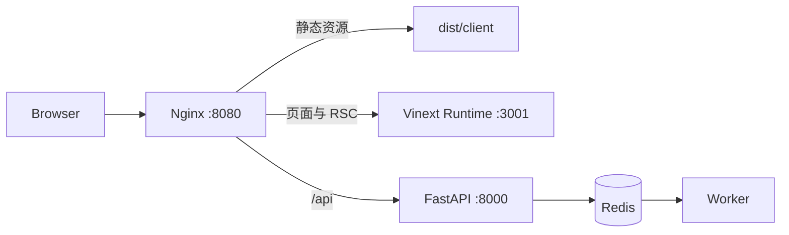

# Web 开发、测试与交付

本文档是 `web/` 浏览器入口的可执行开发手册。架构取舍与分阶段范围见 [Web 入口方案设计](web-entry-design.md)。

## 1. 环境要求

- Docker Desktop 与 Docker Compose v2；
- Node.js 22.13 或更高版本；
- npm（使用仓库内 `package-lock.json`）；
- 首次运行浏览器测试时可访问 Playwright 浏览器下载源。

所有本地命令默认使用 Mock OSS、Mock AI 和开发态微信登录，不需要云服务密钥。不要提交 `.env`。

## 2. 首次启动

在仓库根目录准备后端：

```powershell
if (-not (Test-Path .env)) { Copy-Item .env.example .env }
docker compose up -d --build
docker compose exec api alembic upgrade head
docker compose restart api worker
Invoke-RestMethod http://localhost:8000/ready
```

再启动 Web 开发服务器：

```powershell
Set-Location web
npm ci
if (-not (Test-Path .env.local)) { Copy-Item .env.example .env.local }
npm run dev
```

打开 <http://localhost:3001/login>。API 就绪地址为 <http://localhost:8000/ready>。

macOS/Linux 使用 `cp` 代替 `Copy-Item`，其余命令相同。

## 3. 质量门禁

```powershell
Set-Location web
npm run lint
npm run typecheck
npm run test
npm run build
```

等价的本地聚合命令是 `npm run check`。单元测试覆盖 API 错误归一化、媒体 URL、文件策略、SSE 中文跨 chunk 和生成状态机。

## 4. Playwright E2E

首次安装 Chromium：

```powershell
Set-Location web
npx playwright install chromium
```

确保 Docker 后端、Worker、PostgreSQL 和 Redis已启动，然后执行：

```powershell
npm run test:e2e
```

浏览器测试使用独立开发用户和仓库测试图片，覆盖：

1. 开发态登录；
2. Mock OSS 直传和照片登记；
3. 等待异步智能索引完成后执行 Agent 搜索；
4. 从 Skill 广场选择配方、创建生成任务并等待 Worker 完成；
5. 在生成历史中查看结果；
6. 登录页、时间线、Skill 广场的 WCAG A/AA 自动扫描；
7. Pixel 7 视口下的导航可用性和横向溢出检查。

失败时保留 `web/test-results/`、trace、截图和视频。打开 trace：

```powershell
npx playwright show-trace test-results/<case>/trace.zip
```

E2E 是会写入隔离开发账号的真实本地集成测试。不要把它指向生产 API。

## 5. Docker/Nginx 交付

Vinext 仍需要运行时处理 RSC/SSR，因此交付方案采用两层结构：Nginx 直接提供带哈希的 `/_next/static/`、图标和社交预览等静态资源，并将页面/RSC 请求转发给 Web Runtime；`/api/`（包括 Mock OSS 的 `/api/_mock/oss/`）同源转发给 FastAPI。这样浏览器不需要额外 CORS 配置，SSE 与 Mock 大文件 PUT 也保留流式行为；真实 OSS 签名 URL 仍由浏览器直传 Bucket。



在根目录启动完整交付栈：

```powershell
if (-not (Test-Path .env)) { Copy-Item .env.example .env }
docker compose -f docker-compose.yml -f docker-compose.web.yml up -d --build
docker compose -f docker-compose.yml -f docker-compose.web.yml exec api alembic upgrade head
Invoke-WebRequest http://localhost:8080/login
```

默认入口为 <http://localhost:8080/login>。可用 `WEB_PORT` 修改宿主端口。停止并保留数据卷：

```powershell
docker compose -f docker-compose.yml -f docker-compose.web.yml down
```

正式环境必须把 `NEXT_PUBLIC_ENABLE_DEV_LOGIN=false` 作为构建参数，接入正式 Web 身份体系，替换 JWT 密钥、启用 HTTPS、收紧来源与 OSS CORS；不要直接把开发态 Compose 当作公网生产配置。

要用确定性的 Mock OSS/Mock AI 验证交付入口，可追加专用覆盖文件；它只覆盖 API 和 Worker 的外部服务凭据，不应与生产配置混用：

```powershell
$env:WEB_PORT = "8081" # 仅在 8080 已占用时需要
docker compose -f docker-compose.yml -f docker-compose.web.yml -f docker-compose.e2e.yml up -d --build
$env:WEB_BASE_URL = "http://127.0.0.1:8081"
Set-Location web
npm run test:e2e
```

## 6. CI

`.github/workflows/web-ci.yml` 包含三个门禁：

- `quality`：lint、显式 typecheck、unit、build；
- `e2e`：启动 Mock Docker 后端、Web Runtime 与 Nginx，并通过交付入口运行 Chromium E2E；
- `delivery-image`：验证 Compose 合并模型并构建 Web Runtime/Nginx 镜像。

任一门禁失败都会阻止 Phase 4 验收。E2E 失败产物会上传为 GitHub Actions artifact，后端日志始终输出并清理测试数据卷。

## 7. 常见问题

- 登录按钮跳回带 `nickname` 的 URL：等待页面客户端代码加载完成后再交互；自动化已使用 `networkidle` 门禁。
- 上传完成但搜索为空：照片处理和向量索引是异步任务，应等待“智能搜索已就绪”。
- `localhost:3001` 被占用：关闭已有开发服务；Vinext 配置启用了严格端口。
- E2E 无浏览器：重新执行 `npx playwright install chromium`，Linux CI 使用 `--with-deps`。
- 真实 OSS 在上传进度中报“网络连接失败”：检查 Bucket CORS 是否允许 Web Origin 发起 `PUT` 并携带 `Content-Type`；CI 使用 `docker-compose.e2e.yml` 隔离该外部依赖。
- Nginx 返回 502：检查 `web-runtime`、`api`、`worker` 健康状态和 `docker compose logs`。
