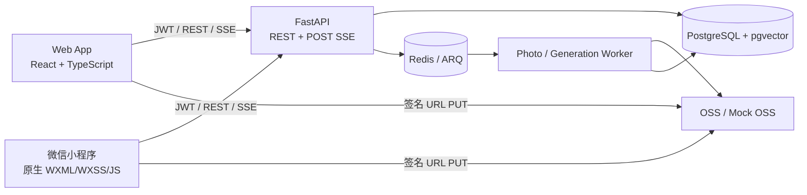
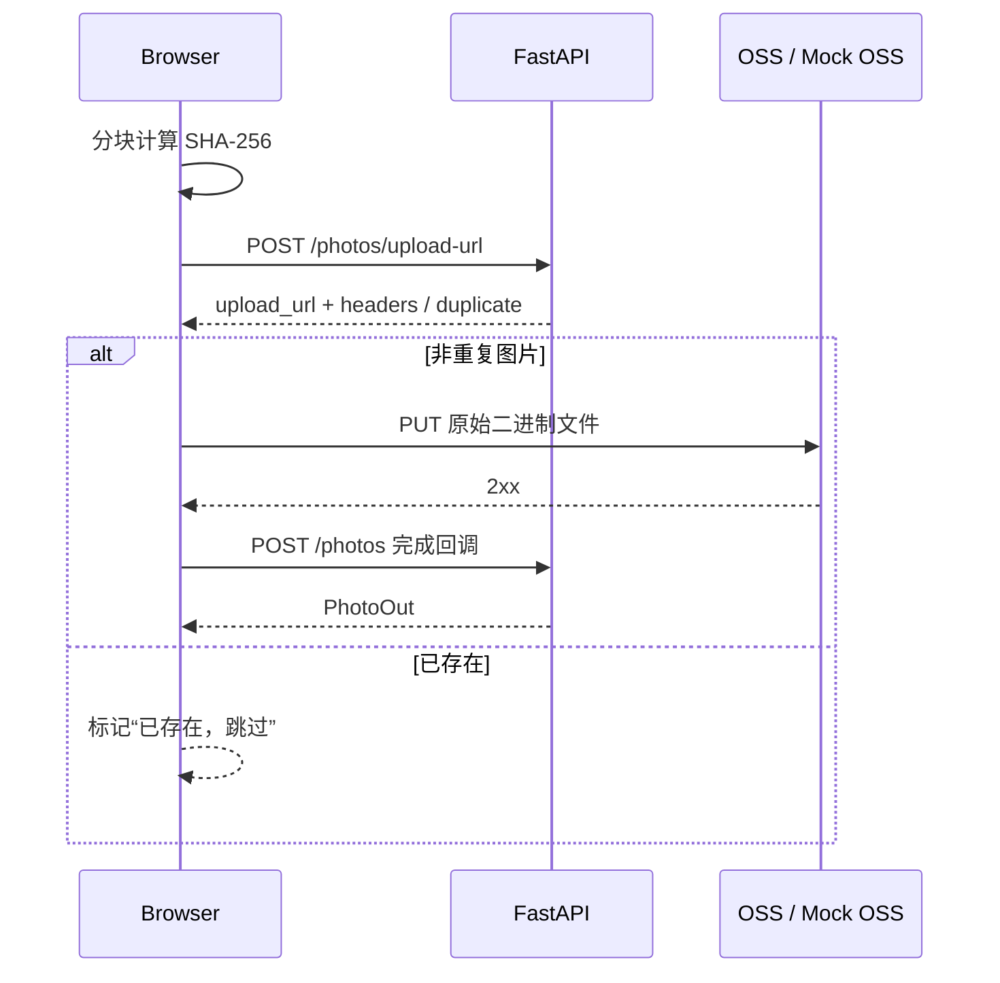

# Photo Agent Web 入口方案设计

> 状态：Proposed  
> 日期：2026-08-22  
> 目标：在保留微信小程序的前提下，新增一个能够覆盖现有主要功能、适合日常开发和联调的浏览器入口。

## 1. 结论

在仓库根目录新增独立的 `web/` 前端，采用 **React + TypeScript + Vite/Vinext** 构建 Web 应用，直接复用现有 FastAPI REST/SSE 接口和 JWT 鉴权。Vinext 保留 Next 风格的文件路由和组件模型，同时由 Vite 提供开发与构建能力。

首期不把原生微信小程序迁移到 Taro/uni-app，也不尝试直接共享页面代码。现有小程序大量依赖 `wx.*`、`Page`、`getApp()` 和 WXML/WXSS，强行跨端改造会扩大回归范围。Web 与小程序只共享以下稳定边界：

1. FastAPI OpenAPI 接口契约；
2. 业务状态与错误码语义；
3. 设计 token、交互规则和验收用例；
4. 后续可逐步提取的纯算法代码。

Web 首期定位为开发、演示和验收入口。它可以跑通登录、时间线、上传、智能搜索/Agent、Skill、图片生成和生成历史。生产级 Web 登录作为独立阶段处理，避免把开发态 Mock 登录误当成正式用户体系。

## 2. 现状与可复用能力

当前项目已经具备完整后端，不需要另建一套 Web 后端：

- `app/main.py` 提供 FastAPI 应用、OpenAPI、JWT、CORS 和统一错误处理；
- `app/api/` 已覆盖 Auth、Photo、Search、Agent、Skill、Generation；
- 上传链路已采用“申请签名 -> 客户端 PUT 直传 -> 完成回调”；
- `/agent/stream` 已提供 POST SSE 流式结果；
- 开发环境已支持 Mock OSS、Mock AI 和 Mock 微信登录；
- 小程序已有 8 个页面，可作为 Web 功能和交互口径的事实来源。

现有小程序到 Web 的功能映射如下：

| 小程序页面 | Web 路由 | Web 首期能力 |
|---|---|---|
| `pages/login` | `/login` | 开发态一键登录、会话失效处理 |
| `pages/timeline` | `/photos` | 照片瀑布流、分页、详情、删除、处理状态 |
| `pages/upload` | `/upload` | 拖拽/多选、SHA-256、直传、逐文件进度和失败重试 |
| `pages/search` | `/search` | Agent 对话、POST SSE、澄清、结果选择、继续加载 |
| `pages/skills` | `/skills` | 广场/我的 Skill、额度、进入生成 |
| `pages/skill-edit` | `/skills/new`、`/skills/:id/edit` | 新建、编辑、公开设置、参考图 |
| `pages/generate` | `/generate/:skillId?` | 选择源图、附加提示、费用确认、任务轮询 |
| `pages/generations` | `/generations` | 生成历史、状态和结果预览 |

## 3. 目标与非目标

### 3.1 首期目标

- 浏览器中跑通现有小程序的主要业务闭环；
- `docker compose` 启动后，只需再启动一个前端开发服务器即可联调；
- 前端接口类型由 FastAPI OpenAPI 生成，减少手写请求/响应类型漂移；
- 支持浏览器 Network、React Query Devtools 和 Playwright 自动化；
- 保持后端核心业务、数据库和 Worker 不变；
- 桌面端优先，同时提供可用的移动端响应式布局。

### 3.2 首期非目标

- 不替换、不下线现有微信小程序；
- 不在第一阶段建设 SEO 或服务端渲染；
- 不在第一阶段建设完整生产账号体系；
- 不把两个端的 UI 抽象为一套跨端组件；
- 不重写照片处理、检索、Agent 或生成服务。

## 4. 技术方案

### 4.1 技术选型

| 领域 | 选择 | 原因 |
|---|---|---|
| 构建工具 | Vite + Vinext | Vite 提供开发/构建能力，Vinext 提供文件路由并保持 Sites 兼容 |
| UI 框架 | React + TypeScript | 组件化、生态成熟，便于做复杂搜索对话和上传状态 |
| 路由 | Vinext 文件路由 | 与当前脚手架一致，按 `app/**/page.tsx` 组织页面，减少额外路由配置 |
| 服务端状态 | TanStack Query | 统一缓存、分页、轮询、失效和错误状态，并提供开发工具 |
| API 类型 | `openapi-typescript` | 从 FastAPI `/openapi.json` 生成运行时零成本的 TypeScript 类型 |
| 样式 | CSS Modules + CSS variables | 首期依赖少，容易沉淀与小程序一致的颜色、间距和圆角 token |
| 测试 | Vitest + Testing Library + Playwright | 覆盖纯逻辑、组件交互和真实浏览器端到端闭环 |

Vite 只负责编译 TypeScript，CI 中仍需单独执行 `tsc --noEmit` 做类型检查。

### 4.2 总体架构



关键原则：Web 是新客户端，不是新业务系统。后端仍然是鉴权、用户隔离、配额、幂等、安全确认和业务规则的唯一权威来源。

### 4.3 建议目录结构

```text
photo-agent/
├── app/                         # 现有 FastAPI 后端
├── miniprogram/                 # 现有微信小程序
├── web/                         # 新增 Web 应用
│   ├── app/                     # 文件路由、Provider、错误边界与全局样式
│   ├── components/              # 跨 feature 的通用组件
│   ├── features/
│   │   ├── auth/
│   │   ├── photos/
│   │   ├── upload/
│   │   ├── search/
│   │   ├── skills/
│   │   └── generations/
│   ├── lib/
│   │   ├── api/
│   │   │   ├── generated.ts     # OpenAPI 自动生成，禁止手改
│   │   │   ├── client.ts        # JWT、X-Log-ID、错误归一化
│   │   │   ├── agent-stream.ts  # POST SSE fetch 流解析
│   │   │   └── media-url.ts     # 相对 OSS/Mock URL 解析
│   │   └── auth/                # 浏览器会话
│   ├── workers/                 # 文件分块哈希 Web Worker
│   ├── public/
│   ├── test/
│   ├── e2e/
│   ├── .env.example
│   ├── package.json
│   ├── tsconfig.json
│   └── vite.config.ts
└── docs/web-entry-design.md
```

按业务 feature 组织代码，避免把所有请求、hooks、页面和类型堆进全局目录。每个 feature 内部可包含 `api.ts`、`queries.ts`、`components/`、`pages/` 和测试。

## 5. 关键链路设计

### 5.1 开发态登录

首期 Web 在 `APP_ENV=dev` 下复用现有 `/auth/wechat` 的 Mock 行为：

1. `/login` 提供“一键进入开发用户”；
2. 使用固定或可输入的开发 code、nickname 调用 `/auth/wechat`；
3. JWT 保存到 `sessionStorage`，页面关闭后自动清理；
4. API 收到 401 时清除会话并跳回 `/login`；
5. `/auth/me` 用于应用启动时恢复并验证会话。

这一模式只用于本地开发、自动化测试和受控演示。若 Web 需要公开上线，应新增独立的 Web OAuth/账号登录方案，优先使用短期 access token + HttpOnly/SameSite cookie 的会话设计；不要把开发 code 暴露到生产环境。

### 5.2 API 客户端与契约

前端统一通过 `api/client.ts` 请求：

- 自动附加 `Authorization: Bearer <token>`；
- 每次请求生成 `X-Log-ID: web-...`；
- 提取并展示 `X-Log-ID`、`X-Trace-ID`，方便和现有可观测性链路联查；
- 把 FastAPI 的 `detail`、项目自定义错误体和网络错误归一成统一 `ApiError`；
- 正确处理 `204 No Content`；
- 使用 `AbortController` 取消路由切换后的请求。

建议新增脚本：

```json
{
  "scripts": {
    "api:types": "openapi-typescript http://localhost:8000/openapi.json -o lib/api/generated.ts",
    "typecheck": "tsc --noEmit",
    "dev": "vite",
    "test": "vitest run",
    "test:e2e": "playwright test",
    "build": "tsc --noEmit && vite build"
  }
}
```

`generated.ts` 可提交到仓库，CI 再生成一次并检查 diff，从而在后端 Schema 变化时尽早发现客户端契约漂移。

### 5.3 图片上传

浏览器上传保持现有三段式协议：



实现注意事项：

- 使用 `<input type="file" multiple accept="image/*">` 和拖拽区域；
- 后端允许单文件最大 100 MB，不能在主线程一次性读取并哈希大文件；
- 在 Web Worker 中分块读取 `Blob.slice()`，使用支持增量 SHA-256 的实现；
- 默认并发上传 3 个，防止大量文件同时占用内存和网络；
- 使用 XHR 或支持上传进度的适配器执行 PUT，因为原生 `fetch` 暂无稳定的上传进度事件；
- 严格使用签名响应返回的 headers 和真实 `file.type`；
- 单文件失败不阻塞整个队列，支持重试和清理成功项；
- 对 OSS 配置允许 Web Origin 的 `PUT`、`Content-Type` 和必要响应头；
- Mock OSS 返回相对 URL 时，统一相对 `NEXT_PUBLIC_API_ORIGIN` 解析，不能相对页面路由解析。

### 5.4 Agent POST SSE

原生 `EventSource` 只能发 GET，且不方便附加 Bearer Token，因此 Web 必须使用 `fetch`：

1. `POST /agent/stream`，附加 JSON body、JWT、`Accept: text/event-stream`；
2. 从 `response.body` 获取 `ReadableStream`；
3. 使用流式 `TextDecoder` 处理跨 chunk 的 UTF-8 中文字符；
4. 按空行拆分 SSE frame，合并多个 `data:` 行；
5. 事件到达后增量更新对话、工具状态、结果和澄清选项；
6. 用 `AbortController` 提供“停止生成”和离开页面取消；
7. 区分 HTTP 错误、SSE `error` 事件和用户主动取消。

现有小程序 `miniprogram/utils/api.js` 的 UTF-8/SSE 处理逻辑可作为行为参考，但 Web 端应写成无 `wx.*` 依赖、可单元测试的 TypeScript 模块。

### 5.5 照片、Skill 与生成任务

- 时间线使用 `useInfiniteQuery` 管理分页，删除成功后精确失效照片列表；
- 照片详情以抽屉/弹窗展示，原始后端描述按纯文本渲染，禁止直接注入 HTML；
- Skill 广场和“我的 Skill”使用独立 query key；
- 创建/编辑 Skill 成功后失效列表和详情缓存；
- 生成创建、费用确认与轮询沿用后端幂等和安全确认协议；
- 任务在 `pending`/`processing` 状态下轮询，在 `done`/`failed` 后停止；
- 页面刷新后通过 generation id 恢复任务，而不是只依赖内存状态。

## 6. 后端最小改动

首期不需要数据库迁移，也不需要改动核心业务服务。建议仅补齐以下 Web 边界：

1. **CORS 配置化**：新增 `CORS_ORIGINS` 环境变量。开发态默认允许 `http://localhost:3001`；生产态必须显式 allowlist，不能继续使用通配符。
2. **OSS CORS**：本地脚本和真实 Bucket 都加入 Web Origin 的 PUT/GET/HEAD 规则。
3. **开发认证保护**：明确 Mock 微信登录只在 `APP_ENV=dev` 生效，并加入测试防止生产误开。
4. **OpenAPI 稳定性**：保持请求/响应 Schema 完整，CI 生成 Web 类型检查契约漂移。
5. **可选静态托管**：首期前后端分开启动；需要一键演示时，再由 Nginx 或 FastAPI 挂载 `web/dist`。生产更推荐 Nginx/CDN 托管静态资源并反代 API。

当前 `app/main.py` 在开发环境允许所有 Origin、生产环境不允许任何 Origin。正式提供 Web 域名之前必须完成第 1 项，否则生产 Web 无法跨域调用，或只能被迫重新放宽到不安全的通配符。

## 7. 本地开发体验

推荐开发命令：

```powershell
# 终端 1：现有后端、Worker、PostgreSQL、Redis
docker compose up -d --build
docker compose exec api alembic upgrade head

# 终端 2：Web
cd web
npm install
Copy-Item .env.example .env.local
npm run api:types
npm run dev
```

`web/.env.example`：

```dotenv
NEXT_PUBLIC_API_ORIGIN=http://localhost:8000
NEXT_PUBLIC_ENABLE_DEV_LOGIN=true
```

浏览器打开 `http://localhost:3001`。开发期 API 和 Web 分端口运行，既能保留 Vite HMR，也能真实验证 CORS。若开发者只想避免跨域，可在 Vite 中增加代理，但 API Origin 与媒体 URL 解析仍必须保持为显式配置。

## 8. 分阶段落地

### Phase 0：脚手架与契约

- 建立 `web/`、路由、布局、主题 token、错误边界；
- 完成 OpenAPI 类型生成、API client、开发态登录；
- 增加 Web lint/typecheck/unit test/build CI；
- 后端 CORS 改为环境变量配置。

验收：开发用户可登录并看到 `/auth/me` 信息；请求错误能显示 Log ID。

### Phase 1：核心照片闭环

- 时间线、分页、详情、删除；
- 多图选择/拖拽、分块哈希、签名 PUT、完成回调；
- 处理状态显示、失败重试；
- 普通语义搜索结果页。

验收：从浏览器上传一张图片，等待处理完成，并用自然语言搜索到它。

### Phase 2：Agent 搜索

- POST SSE client；
- 对话消息、进度、工具调用、澄清选项；
- 结果选择、加载更多、停止请求；
- SSE parser 和中文跨 chunk 测试。

验收：完成“提问 -> 澄清/检索 -> 选择照片”的 Agent 闭环，刷新和取消不会污染下一次会话。

### Phase 3：Skill 与生成

- Skill 广场、我的 Skill、新建/编辑；
- 选择源图、生成前确认、幂等 key；
- 任务轮询、历史与结果预览。

验收：从 Skill 进入生成，确认费用，任务完成后可在历史中查看。

### Phase 4：自动化与交付

- Playwright 覆盖登录、上传、搜索、生成主路径；
- 响应式和无障碍检查；
- Docker/Nginx 静态交付方案；
- 更新 README 和开发文档。

验收：新环境按文档可启动；CI 中 typecheck、unit、build、E2E 全部通过。

## 9. 测试与质量门禁

### 9.1 单元测试

- SSE frame 拆分、中文 UTF-8 跨 chunk、多个 `data:` 行；
- API 错误归一化和 401 退出；
- 相对/绝对媒体 URL 解析；
- 上传队列并发、取消、失败重试和重复文件；
- generation 状态机与轮询停止条件。

### 9.2 组件测试

- 路由鉴权；
- 照片分页、空状态、错误态；
- Skill 编辑校验；
- 生成费用确认；
- 对话和澄清交互。

### 9.3 E2E

使用现有 Mock OSS/Mock AI 环境，至少覆盖：

1. 开发态登录；
2. 上传图片并看到处理状态；
3. 搜索并打开结果；
4. Agent 流式响应和取消；
5. 创建/选择 Skill；
6. 确认生成并查看历史；
7. 401、上传失败和生成失败路径。

## 10. 安全与性能

- 生产关闭开发登录，生产 CORS 只允许正式 Web 域名；
- 前端不包含 OSS、模型或后台管理密钥；
- Agent、照片描述和错误文本默认按纯文本渲染，避免 XSS；
- JWT 首期只在开发态使用 `sessionStorage`，正式 Web 上线前重新设计会话；
- 上传哈希和图片预处理放到 Worker，避免阻塞 UI；
- 限制上传并发并及时 `URL.revokeObjectURL()`；
- 照片列表使用缩略图、懒加载和虚拟化阈值，避免一次加载原图；
- 所有请求保留 Log ID/Trace ID，便于前后端故障联查；
- 不在前端复制配额、确认和权限规则，避免绕过后端安全边界。

## 11. 风险与应对

| 风险 | 影响 | 应对 |
|---|---|---|
| 小程序和 Web 两套 UI 逐渐不一致 | 功能口径漂移 | 共享 OpenAPI、验收用例和设计 token；新增接口同时检查两端 |
| 浏览器上传大文件时卡顿/爆内存 | 上传不可用 | Worker + 分块哈希 + 限并发，不使用整文件 `arrayBuffer()` 哈希 |
| POST SSE 被代理缓冲 | 不能实时显示 | Nginx 关闭该路由缓冲，增加真实部署流式 E2E |
| OSS CORS 未配置 | 签名成功但 PUT 失败 | 把 Bucket CORS 纳入部署检查和自动化脚本 |
| 开发 Mock 登录进入生产 | 安全事故 | 环境硬门禁、启动日志告警和生产配置测试 |
| 手写前端类型与后端漂移 | 运行期报错 | OpenAPI 自动生成 + CI diff/typecheck |
| 同时迁移小程序导致范围失控 | 延期和回归 | 首期保留原生小程序，仅新增 Web 客户端 |

## 12. 最终验收定义

完成以下条件即可认为 Web 入口首期交付：

- `web/` 可以独立安装、开发、测试和构建；
- 不依赖微信开发者工具即可完成核心业务闭环；
- 登录、时间线、上传、搜索/Agent、Skill、生成、历史全部可用；
- Web 请求使用现有 JWT 用户隔离，后端无新数据库分支；
- 上传仍然直传 OSS，API 不转发大文件；
- Agent 保持流式体验，支持取消和错误恢复；
- OpenAPI 类型生成、typecheck、unit、build 和关键 E2E 进入 CI；
- 现有小程序功能和后端测试不回归；
- 生产部署前完成正式 Web 登录、CORS allowlist、HTTPS 与 OSS CORS 检查。

## 13. 参考资料

- [Vite 官方指南](https://vite.dev/guide/)
- [TanStack Query React 官方文档](https://tanstack.com/query/latest/docs/framework/react/overview)
- [OpenAPI TypeScript 官方文档](https://openapi-ts.dev/introduction)
- [MDN：使用 ReadableStream](https://developer.mozilla.org/en-US/docs/Web/API/Streams_API/Using_readable_streams)
